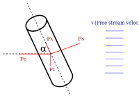

# Cross-flow on a cylinder
{:.no_toc}

* A markdown unordered list for the toc
{:toc}

To compute the force acting on a cylinder we will use the cross-flow principle [^Hoerner].

[^Hoerner]: Hoerner, Sighard F.. *Fluid-dynamic Drag: Practical Information on Aerodynamic Drag and Hydrodynamic Resistance.* United Kingdom: Hoerner Fluid Dynamics, 1965.

<div class="photo" style="width: 600px;">

</div>

In terms of the free stream velocity $v$ the components of the velocities normal to the axis of the cylinder, $v_N$ and parallel to the axis, $v_A$ are given as

$$
v_N=v\sin\alpha   \\
v_A=v\cos\alpha
$$

## Force directed normal to cylinder

The normal force is computed using the standard expression[^wiki1] for the pressure drag acting on a cylinder with its axis oriented perpendicular to the direction of flow

[^wiki1]: https://en.wikipedia.org/wiki/Drag_(physics)#The_drag_equation

$$
F_N=C_{DN} \left(\frac{\rho v_N^2}{2}\right) A \tag{1}
$$


where $C_{DN}$ is the drag coefficient, $A=d L$ is the *projected area* of the cylinder, and $\rho$ is the fluid density.  For air at standard temperature[^stpwiki] and pressure $\rho=1.22~\kg/\m^3$.

[^stpwiki]: https://en.wikipedia.org/wiki/U.S._Standard_Atmosphere

The drag coefficient is a function of Reynolds number

$$
Re=\frac{vD}{\nu} \tag{2}
$$

where $\nu$ is the kinematic viscosity.  For air at standard[^stpwiki] temperature and pressure $\nu=1.461×10^{-5} \m^2/\s$.


<div class="photo" style="width: 600px;">
  <a href="img/DragCylinder.png"></a>
  <p>
  Drag coefficient of a long smooth circular cylinder as a function of Reynolds number.  The circles with plus, ⊕,  are data from <a href="https://doi.org/10.1017/S002211206500109X">Jayaweera and Mason</a>.  The open circles are data from <a href="https://doi.org/10.1017/S0022112059000829">Tritton, 1959</a>.    The remaining data is from <a href="https://ntrs.nasa.gov/search.jsp?R=19930080855">Wieselsberger, 1922</a> and has legend entries corresponding to the various cylinder diameters employed in that work.
  </p>
</div>

Experimental data for the drag coefficient of a smooth cylinder is shown above.  The red curve is the fit function shown below.  Other functional forms are also available. [^Cheng] [^White]

[^White]: White, F.M. (2006) Viscous Fluid Flow. 3rd Edition, McGraw-Hill, Boston.


[^Cheng]: Nian-Sheng Cheng, *Calculation of Drag Coefficient for Arrays of Emergent Circular Cylinders with Pseudofluid Model.* J. Hydraul. Eng. 2013.139:602-611.


```JavaScript
function DragCylinder(Re) {

  w = Math.log10(Re);

  if (Re <= 200000) {
    return 11.*Math.pow(Re,-0.75) + 0.9*(1.0-Math.exp(-1000./Re))+1.2*(1.0-Math.exp(-Math.pow(Re/4500.,0.7)));
  }

  if (Re <= 500000) {
    return Math.pow(10, -0.32*(Math.tanh(8.*(w-5.5563))+1.0)+0.081206842);
    }

  if (Re > 500000) {
    return 0.1*w - 0.2533429;
  }

}
```

## Force directed parallel to cylinder

The axial force is dominated by friction drag[^Fox](equation 9.30)

$$
F_A=C_{Df} \left(\frac{\rho v_A^2}{2}\right) A_w \tag{3}
$$

where $A_w=\pi d L$ is the wetted area of the cylinder.  The drag coefficient for friction drag is taken from [^Fox](equation 9.34)

$$
C_{Df} = \frac{0.455}{\left(\log Re_L\right)^{2.58}} \tag{4}
$$

and is an empirical relation valid for $Re_L < 10^{9}$.  In this case the Reynolds is:

$$
Re_L=\frac{vL}{\nu}  \tag{5}
$$

[^Fox]: Fox, Robert W., Alan T. McDonald, and Philip J. Pritchard. 2008. *Introduction to fluid mechanics.* Hoboken, N.J.: Wiley.


## Lift and drag forces

The normal and axial forces can be expressed as lift and drag forces on the cylinder through the relations

$$
F_D=F_N \sin\alpha + F_A \cos\alpha
$$

$$
F_L=F_N \cos\alpha - F_A\sin\alpha
$$
