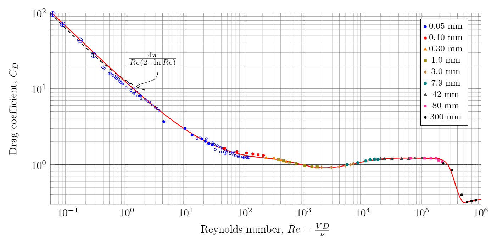

# Cross-flow on a cylinder
{:.no_toc}

* A markdown unordered list for the toc
{:toc}

To compute the force acting on a cylinder we will use the cross-flow principle [^Hoerner].

[^Hoerner]: Hoerner, Sighard F.. *Fluid-dynamic Drag: Practical Information on Aerodynamic Drag and Hydrodynamic Resistance.* United Kingdom: Hoerner Fluid Dynamics, 1965.

<div class="photo" style="width: 400px;">

</div>

In terms of the free stream velocity $v$ the components of the velocities normal to the axis of the cylinder and parallel to the axis are given as

$$
v_N=v\sin\alpha  \nonumber\\
v_A=v\cos\alpha
$$

## Normal force

The normal force is computed using the standard expression for the drag

$$
F_N=C_{DN} \left(\frac{\rho v_N^2}{2}\right) A
$$

where $C_DN$ is the drag coefficient, in this case for a cylinder, and $A=d l$ is the *projected area* of the cylinder.

The drag coefficient is a function of Reynolds number

$$
Re=\frac{vD}{\nu}
$$

<div class="photo" style="width: 400px;">
  <a href="img/DragCylinder.png"></a>
</div>

```JavaScript
function DragCylinder(Re) {

  w = Math.log10(Re);

  if (Re <= 200000) {
    return 11.*Math.pow(Re,-0.75) + 0.9*(1.0-Math.exp(-1000./Re))+1.2*(1.0-Math.exp(-Math.pow(Re/4500.,0.7)));
  }

  if (Re <= 500000) {
    return Math.pow(10, -0.32*(Math.tanh(8.*(w-5.5563))+1.0)+0.081206842);
    }

  if (Re > 500000) {
    return 0.1*w - 0.2533429;
  }

}
```

## Axial force

The axial force is dominated by friction drag

$$
F_A=C_{Df} \left(\frac{\rho v_A^2}{2}\right) A_w
$$

where $A_w=\pi d L$ is the wetted area of the cylinder.  The drag coefficient for friction drag is taken from [^Fox]

$$
C_{Df} = \frac{0.455}{\left(\log Re_L\right)^{2.58}}
$$


depends on the Reynolds number is


$$
Re_L=\frac{vL}{\nu}
$$

[^Fox]: Fox, Robert W., Alan T. McDonald, and Philip J. Pritchard. 2008. *Introduction to fluid mechanics.* Hoboken, N.J.: Wiley.


## Cylinders


# Lift and drag forces

The normal and axial forces can be expressed as lift and drag forces on the cylidner through the relations

$$
F_D=F_N \sin\alpha + F_A \cos\alpha
$$

$$
F_L=F_N \cos\alpha - F_A\sin\alpha
$$
