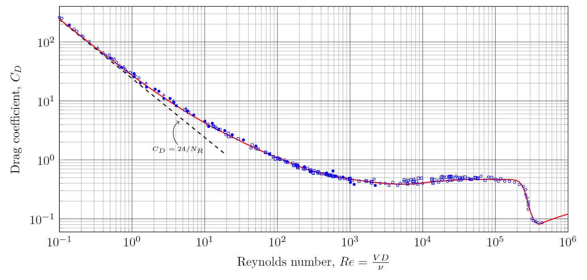
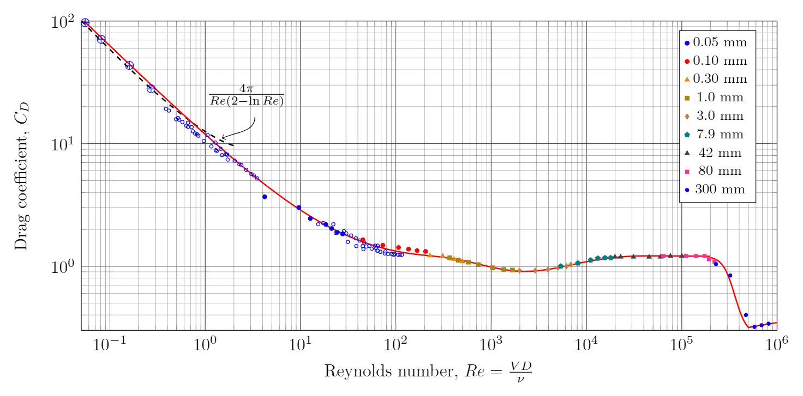
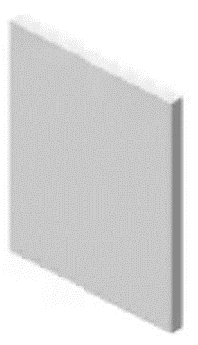
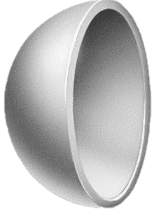

$$
\require{cancel}
\newcommand{\s}{\mathrm{s}}
\newcommand{\min}{\mathrm{min}}
\newcommand{\hr}{\mathrm{hr}}
\newcommand{\kg}{\mathrm{kg}}
\newcommand{\kN}{\mathrm{kN}}
\newcommand{\inch}{\mathrm{in}}
\newcommand{\ft}{\mathrm{ft}}
\newcommand{\m}{\mathrm{m}}
\newcommand{\mm}{\mathrm{mm}}
\newcommand{\km}{\mathrm{km}}
\newcommand{\mi}{\mathrm{mi}}
\newcommand{\cm}{\mathrm{cm}}
\newcommand{\lb}{\mathrm{lb}}
\newcommand{\lbm}{\mathrm{lbm}}
\newcommand{\lbf}{\mathrm{lbf}}
\newcommand{\N}{\mathrm{N}}
\newcommand{\slug}{\mathrm{slug}}
\newcommand{\Pa}{\mathrm{Pa}}
\newcommand{\kPa}{\mathrm{kPa}}
\newcommand{\mph}{\mathrm{mph}}
\renewcommand{\psi}{\mathrm{psi}}
\newcommand{\C}{^\circ\mathrm{C}}
\newcommand{\F}{^\circ\mathrm{F}}
\newcommand{\Re}{\mathrm{Re}}
\newcommand{\WP}{\mathrm{WP}}
\newcommand{\L}{\mathrm{L}}
\newcommand{\gpm}{\mathrm{gpm}}
\newcommand{\cfm}{\mathrm{cfm}}
\newcommand{\fpm}{\mathrm{fpm}}
\newcommand{\inwg}{\mathrm{inH}_2\mathrm{O}}
$$

# Drag and Lift
{:.no_toc}

* A markdown unordered list for the toc
{:toc}

An object moving through a fluid will experience a force on it.  The force that acts opposite to the direction of motion we refer to as drag.  The force that acts perpendicular to the direction of motion we refer to as lift.

# Drag Force

The drag force on an object is

$$
F_D=C_D \left(\frac{\rho}{2}v^2\right) A
$$

In the above expression, $C_D$ is a dimensionless number known as the drag coefficient.  $rho$ is the density of the fluid.  $v$ is the velocity of the stream of fluid relative to the body. The stream could be moving with velocity $v$ while the body is at rest, of the fluid could be at rest and with the body moving with velocity $v$.
$A$ is a *characteristic area* of the body and will be defined carefully for each object in the subsequent sections.  It is usually taken as the largest cross-sectional area of the body perpendicular to the flow, also known as the projected area.

The drag coefficient, $C_D$, depends on the shape and orientation of the body.  It also depends on the Reynolds number and the roughness of the object's surface.  It can also be influenced by other bodies in the vicinity of the object in question.  Ultimately the drag coefficient will be taken from experiments.  

## Spheres

  
  

  Drag coefficient of a smooth sphere as a function of Reynolds number.
  Open triangles are data from <a href="https://doi.org/10.1017/S002211206500143X">Maxworthy, 1965</a>.
  Open squares are data from <a href="https://doi.org/10.2514/3.6164">Roos and Willmarth, 1971</a>.  
  The remaining data points are from earlier experiments,
  <a href="https://doi.org/10.1007/978-3-662-52919-5">Schlichting, 1979</a>
  

## Cylinders

  
  

  Drag coefficient of a long smooth circular cylinder as a function of Reynolds number.  The circles with plus, ⊕,  are data from <a href="https://doi.org/10.1017/S002211206500109X">Jayaweera and Mason</a>.  The open circles are data from <a href="https://doi.org/10.1017/S0022112059000829">Tritton, 1959</a>.    The remaining data is from <a href="https://ntrs.nasa.gov/search.jsp?R=19930080855">Wieselsberger, 1922</a> and has legend entries corresponding to the various cylinder diameters employed in that work.
  

## Cylindrical shapes

<table class="table table-striped">
<caption>
Rough estimate of the drag coefficient for various cylindrical shapes from <a href="https://ntrs.nasa.gov/search.jsp?R=19930091694">NACA-TR-619</a>.  The three elliptical struts were taken at a Reynolds number of $10^5$.  The remaining shapes are valid for a Reynolds number between $10^{4}$ and $5\times10^{4}$.
  
The length scale used in the calculation of the Reynolds number is the length of the object in the direction parallel to the flow. An exception is the two semitubular cylinders which use their diameter.
</caption>
<thead>
<tr><th> Shape  </th><th>Flow orientation</th><th style="padding:10px"> $C_D$ </th></tr>
</thead>
<tbody>

<tr>
<td>Circular cylinder</td>
<td style="text-align:center">&#8594;&nbsp;&nbsp;

</td>
<td style="text-align:center">$1.2$</td>
</tr>

<tr>
<td>Semitubular cylinder with open front</td>
<td style="text-align:center">&#8594;&nbsp;&nbsp;

</td>
<td style="text-align:center">$2.4$</td>
</tr>

<tr>
<td>Semitubular cylinder with open rear</td>
<td style="text-align:center">&#8594;&nbsp;&nbsp;

</td>
<td style="text-align:center">$1.1$</td>
</tr>

<tr>
<td>Square cylinder with face towards flow</td>
<td style="text-align:center">&#8594;&nbsp;&nbsp;

</td>
<td style="text-align:center">$2$</td>
</tr>

<tr>
<td>Square cylinder with edge towards flow</td>
<td style="text-align:center">&#8594;&nbsp;&nbsp;

</td>
<td style="text-align:center">$1.6$</td>
</tr>

<tr>
<td>Elipse 2:1</td>
<td>&#8594;&nbsp;&nbsp;

</td>
<td style="text-align:center">$0.45$</td>
</tr>

<tr>
<td>Elipse 4:1</td>
<td style="text-align:center">&#8594;&nbsp;&nbsp;

</td>
<td style="text-align:center">$0.3$</td>
</tr>

<tr>
<td>Elipse 8:1</td>
<td style="text-align:center">&#8594;&nbsp;&nbsp;

</td>
<td style="text-align:center">$0.22$</td>
</tr>

</tbody>
</table>

## 3D shapes

<table class="table table-striped">
<caption>
Drag coefficient for various 3D shapes

<a href="https://ntrs.nasa.gov/search.jsp?R=19930091586">NACA-TR-513</a>
</caption>
<thead>
<tr><th> Shape  </th><th>Flow orientation</th><th style="padding:10px"> $C_D$ </th></tr>
</thead>
<tbody>

<tr>
<td>Square plate perpendicular to flow</td>
<td>&#8594;&nbsp;&nbsp;</td>
<td>$1.16$</td>
</tr>

<tr>
<td>Hemispherical cup with open front</td>
<td>&#8594;&nbsp;&nbsp;</td>
<td>$1.4$</td>
</tr>

<tr>
<td>Hemispherical cup with open back</td>
<td>&#8594;&nbsp;&nbsp;</td>
<td>$0.4$</td>
</tr>

</tbody>
</table>

# Lift and drag on airfoils

The lift force on an airfoil is given as

$$
F_L=C_L \left(\rho v^2/2\right) A
$$

where $C_L$ is a dimensionless lift coefficient that primarily dependent on the shape of the airfoil and its angle of attack.  Keep in mind that it can also depend on the Reynolds number, Mach number, surface roughness, and the aspect ratio.  The area, $A$, is taken as the span of the airfoil multiplied by the chord.

$$
F_D=C_D \left(\rho v^2/2\right) A
$$
