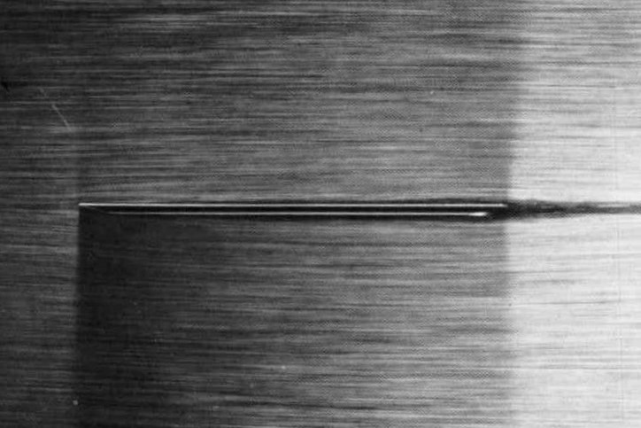
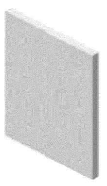

# Drag and Lift
{:.no_toc}

* A markdown unordered list for the toc
{:toc}

An object moving through a fluid will experience a complicated set of forces acting on it.  In order to understand the behavior of the object as it moves through the fluid, we will focus on two resultant forces--drag and lift.
The drag force acts parallel to the motion of the object while the lift force acts in a direction perpendicular to the motion.  

Instead of considering an object moving through a fluid at rest, we can consider the same object at rest in a fluid stream of the same velocity.  The object will experience the same set of forces as illustrated in the picture below.  In this case the drag and lift forces will act parallel and perpendicular to the velocity of the fluid.  

The upper figure shows an airfoil moving to the left with velocity $v$ in a fluid at rest.  The lower figure shows the same airfoil at rest in a fluid stream moving to the right with velocity $v$.  Both airfoils will experience the same set of forces.

## Drag Force equation

The drag force on an object is

$$
F_D=C_D \left(\frac{\rho v^2}{2}\right) A
$$

In the above expression, $C_D$ is a dimensionless number known as the drag coefficient.  $\rho$ is the density of the fluid.  $v$ is the free stream velocity of the fluid relative to the body.  $A$ is a *characteristic area* of the body and will be defined carefully for each object in the subsequent sections.  It is usually taken as the largest cross-sectional area of the body perpendicular to the flow, also known as the projected area.

The combined term $\rho v^2/2$ is called the *dynamic pressure*.  Note that the drag force is proportional to the dynamic pressure and therefore the velocity squared.  If the velocity increases by a factor of two the drag force will increase by a factor of four.

The drag coefficient, $C_D$, depends on the shape and orientation of the body.  It also depends on the Reynolds number and the roughness of the object's surface.  It can also be influenced by other bodies in the vicinity of the object.  Ultimately the drag coefficient will be taken from experimental data.  

## Friction vs pressure drag

The drag force on an object is usually divided into two components; *friction drag* and *pressure drag* (also called *form drag*).  The friction drag is due to the friction between the fluid and the surface of the object.  The pressure drag is sensitive to the shape of the object and how the fluid separates from the boundary of the object.  The total drag is the sum of these two contributions.  

  &nbsp;&nbsp;&nbsp;
  
Visualization using air bubbles in water over a beveled flat plate at a Reynolds number of 10,000.  When the plate is parallel to the flow the drag is due entirely to friction drag.  As the angle of incidence increases to 20&deg; the flow completely separates from the upper edge of the plate and the drag is dominated by pressure drag.     <small>Images from Van Dyke, Milton, and Milton Van Dyke. <em>An album of fluid motion.</em> Vol. 176. Stanford: Parabolic Press, 1982.</small>
  

## Drag Coefficients of Common Geometries

### Spheres

  
  

  Drag coefficient of a smooth sphere as a function of Reynolds number.
  <a href="https://kdusling.github.io/teaching/Applied-Fluids/ImageDisplay.html?src=DragSphere">Details</a>.
  

Monica Seles serves a tennis ball without spin at a velocity of 85 mph.  If the ball has a diameter of 2.56 inches, estimate the drag force on the ball.  For this exercise you may treat the tennis ball as a smooth sphere.

The drag force is calculated using

$$
F_D=C_D \left(\frac{\rho v^2}{2}\right) A
$$

In the above expression $\rho=2.377\times 10^{-3}~\slug/\ft^3$ is the density of air at STP. (I got this number from <a href="https://kdusling.github.io/teaching/Applied-Fluids/AtmosphereProperties.html">here</a> by entering 0 feet elevation).  The velocity is  $v=85~\textrm{mph} =  125~\textrm{fps}$.

The area $A$ is the *projected area* of the sphere.

$$
A=\pi D^2/4=\pi/4\left(2.56~\inch\right)^2=5.147~\inch^2 = 0.0357~\ft^2
$$

The last step is to find the drag coefficient. In order to do this first compute the Reynolds number

$$
Re=\frac{vD}{\nu}=\frac{125~\ft/s \times 0.213~\ft}{1.572\times 10^{-4}~\ft^2/s}=1.7\times 10^5
$$

The kinematic viscosity of air was taken from <a href="https://kdusling.github.io/teaching/Applied-Fluids/AtmosphereProperties.html">the same link as above</a>.  For a smooth sphere I find $C_D=0.46$. You can estimate this from the graph above or by using an <a href="https://kdusling.github.io/teaching/Applied-Fluids/DragCoefficient.html">online calculator</a>. Putting everything together the drag force is

$$
F_D=C_D \left(\frac{\rho v^2}{2}\right) A = 0.46\left(\frac{0.002377 (125)^2}{2}\right) 0.0357 = 0.3~\lb
$$

According to [Mehta, R., Alam, F. and Subic, A. (2008), <a href="https://onlinelibrary.wiley.com/doi/full/10.1002/jst.11">Review of tennis ball aerodynamics.</a> Sports Technol., 1: 7-16. https://doi.org/10.1002/jst.11] the drag coefficient for a tennis ball is closer to 0.6 or 30&#37; larger than the smooth sphere. This will result in a drag force about 30&#37; larger.

### Cylinders

  
  

  Drag coefficient of a long smooth circular cylinder as a function of Reynolds number.    <a href="https://kdusling.github.io/teaching/Applied-Fluids/ImageDisplay.html?src=DragCylinder">Details</a>.
  

Estimate the force produced by a 126 kph gust of wind on a 1.2 meter tall chimney. Treat the chimney as a smooth cylinder having an outside diameter of 15 cm. Compute the bending moment at the bottom of the chimney.

The drag force is calculated using

$$
F_D=C_D \left(\frac{\rho v^2}{2}\right) A
$$

Let us assume the air is at 25&deg;C and standard pressure.  From <a href="https://kdusling.github.io/teaching/Applied-Fluids/PropertiesOfCommonGases.html">here</a>) I find the density is $\rho=1.188 ~\kg/\m^3$.  The velocity is  $v=126~\textrm{kph} =  35~\m/\s$.

The dynamic pressure is

$$
\left(\frac{\rho v^2}{2}\right) = 0.5\times 1.188~\frac{kg}{m^3}\left(25 \frac{\m}{\s^2}\right)=727.65~\frac{\Pa}
$$

The projected or frontal area of the cylinder is a rectangle of width 15 cm and height 1.2 m.

$$
A=0.15~\m\times 1.2~\m= 0.18~\m^2
$$

The last step is to find the drag coefficient. In order to do this first compute the Reynolds number

$$
Re=\frac{vD}{\nu}=\frac{35~\m/s \times 0.15~\m}{1.52\times 10^{-5}~\m^2/s}=3.45\times 10^5
$$

I took the kinematic viscosity of air from <a href="https://kdusling.github.io/teaching/Applied-Fluids/PropertiesOfCommonGases.html">the same link as above</a>.  For a smooth cylinder I find $C_D=0.64$. You can estimate this from the graph above or by using an <a href="https://kdusling.github.io/teaching/Applied-Fluids/DragCoefficient.html">online calculator</a>. Putting everything together the drag force is

$$
F_D=C_D \left(\frac{\rho v^2}{2}\right) A = 0.64\left(727.65~\Pa\right) 0.18~\m^2 = 84~\N
$$

To calculate the bending moment at the base we first assume that the pressure acts uniformly over the chimney.  The center or pressure will be halfway up the chimney at a distance 0.6~\m from it's base.  The bending moment will be

$$
M_{\textrm{bottom}}=F\times d = 84~\N \times 0.5~\m = 42~\N\m
$$

My biggest concern with the above estimate is the drag coefficient.  At a Reynolds number of $3\times 10^5$ we see that the drag coefficient drops suddenly.  This phenomenon is referred to as the *drag crisis* and it occurs because of a sudden change in the flow pattern of the fluid.   The Reynolds number at which this occurs is very sensitive to the roughness of the object.  To be safe I would instead use a drag coefficient of $1.2$ corresponding to a Reynolds number between $10^4$ and $10^5$. This would double the above estimate of the force and moment on the cylinder.

### Cylindrical shapes

<table class="table table-striped">
<caption>
Rough estimate of the drag coefficient for various cylindrical shapes from <a href="https://ntrs.nasa.gov/search.jsp?R=19930091694">NACA-TR-619</a>.  The three elliptical struts were taken at a Reynolds number of $10^5$.  The remaining shapes are valid for a Reynolds number between $10^{4}$ and $5\times10^{4}$.
  
The length scale used in the calculation of the Reynolds number is the length of the object in the direction parallel to the flow. An exception is the two semitubular cylinders which use their diameter.
</caption>
<thead>
<tr><th> Shape  </th><th>Flow orientation</th><th style="padding:10px"> $C_D$ </th></tr>
</thead>
<tbody>

<tr>
<td>Circular cylinder</td>
<td style="text-align:center">&#8594;&nbsp;&nbsp;

</td>
<td style="text-align:center">$1.2$</td>
</tr>

<tr>
<td>Semitubular cylinder with open front</td>
<td style="text-align:center">&#8594;&nbsp;&nbsp;

</td>
<td style="text-align:center">$2.4$</td>
</tr>

<tr>
<td>Semitubular cylinder with open rear</td>
<td style="text-align:center">&#8594;&nbsp;&nbsp;

</td>
<td style="text-align:center">$1.1$</td>
</tr>

<tr>
<td>Square cylinder with face towards flow</td>
<td style="text-align:center">&#8594;&nbsp;&nbsp;

</td>
<td style="text-align:center">$2$</td>
</tr>

<tr>
<td>Square cylinder with edge towards flow</td>
<td style="text-align:center">&#8594;&nbsp;&nbsp;

</td>
<td style="text-align:center">$1.6$</td>
</tr>

<tr>
<td>Elipse 2:1</td>
<td>&#8594;&nbsp;&nbsp;

</td>
<td style="text-align:center">$0.45$</td>
</tr>

<tr>
<td>Elipse 4:1</td>
<td style="text-align:center">&#8594;&nbsp;&nbsp;

</td>
<td style="text-align:center">$0.3$</td>
</tr>

<tr>
<td>Elipse 8:1</td>
<td style="text-align:center">&#8594;&nbsp;&nbsp;

</td>
<td style="text-align:center">$0.22$</td>
</tr>

</tbody>
</table>

### 3D shapes

<table class="table table-striped">
<caption>
Drag coefficient for various 3D shapes

<a href="https://ntrs.nasa.gov/search.jsp?R=19930091586">NACA-TR-513</a>.
</caption>
<thead>
<tr><th> Shape  </th><th>Flow orientation</th><th style="padding:10px"> $C_D$ </th></tr>
</thead>
<tbody>

<tr>
<td>Square plate perpendicular to flow</td>
<td>
  

    &#8594;&nbsp;&nbsp;
    
  

</td>
<td>$1.16$</td>
</tr>

<tr>
<td>Circular disk perpendicular to flow</td>
<td>
  

   &#8594;&nbsp;&nbsp;
   
   

</td>
<td>$1.17$</td>
</tr>

<tr>
<td>Hemispherical cup with open front</td>
<td>

 &#8594;&nbsp;&nbsp;
 
 

</td>
<td>$1.4$</td>
</tr>

<tr>
<td>Hemispherical cup with open back</td>
<td>

 &#8594;&nbsp;&nbsp;
 
 

</td>
<td>$0.4$</td>
</tr>

</tbody>
</table>

## Lift and drag on airfoils

The lift force on an airfoil is given as

$$
F_L=C_L \left(\rho v^2/2\right) A
$$

where $C_L$ is a dimensionless lift coefficient that primarily dependent on the shape of the airfoil and its angle of attack.  Keep in mind that it can also depend on the Reynolds number, Mach number, surface roughness, and the aspect ratio.  The area, $A$, is taken as the span of the airfoil multiplied by the chord.

$$
F_D=C_D \left(\rho v^2/2\right) A
$$
