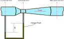
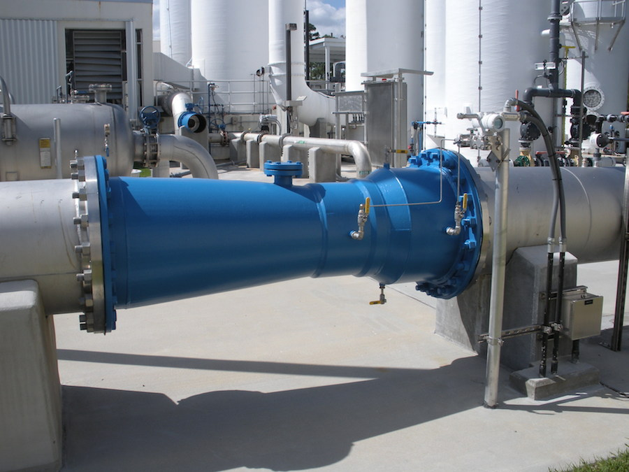

$$
\require{cancel}
\newcommand{\s}{\mathrm{s}}
\newcommand{\min}{\mathrm{min}}
\newcommand{\hr}{\mathrm{hr}}
\newcommand{\kg}{\mathrm{kg}}
\newcommand{\kN}{\mathrm{kN}}
\newcommand{\inch}{\mathrm{in}}
\newcommand{\ft}{\mathrm{ft}}
\newcommand{\m}{\mathrm{m}}
\newcommand{\mm}{\mathrm{mm}}
\newcommand{\km}{\mathrm{km}}
\newcommand{\mi}{\mathrm{mi}}
\newcommand{\cm}{\mathrm{cm}}
\newcommand{\lb}{\mathrm{lb}}
\newcommand{\lbm}{\mathrm{lbm}}
\newcommand{\lbf}{\mathrm{lbf}}
\newcommand{\gal}{\mathrm{gal}}
\newcommand{\L}{\mathrm{L}}
\newcommand{\N}{\mathrm{N}}
\newcommand{\slug}{\mathrm{slugs}}
\newcommand{\Pa}{\mathrm{Pa}}
\newcommand{\kPa}{\mathrm{kPa}}
\newcommand{\MPa}{\mathrm{MPa}}
\newcommand{\mph}{\mathrm{mph}}
\renewcommand{\psi}{\mathrm{psi}}
\newcommand{\C}{^\circ\mathrm{C}}
\newcommand{\F}{^\circ\mathrm{F}}
\newcommand{\sg}{\mathrm{sg}}
$$

# Flow Measurement
{:.no_toc}

* A markdown unordered list for the toc
{:toc}

## Venturi Meter

In a venturi tube the fluid in the main pipe section, labeled as 1, is accelerated into the throat section, labeled 2, where the pressure decreases.  The flow than expands through a diverging portion in order to return to the same diameter pipe.

  
  

  Schematic of a venturi meter
  

The volume flow rate is related to the pressure difference between points 1 and 2 through the relation:

$$
Q=A_1\sqrt{\frac{2g\left(p_1-p_2\right)/\gamma}{\left(A_1/A_2\right)^2-1}}
$$

  
  

  Photograph of an installed HVT-FV Halmi Fabricated Venturi meter.
  

## Pitot tubes

For a pitot tube, the flow velocity is related to the difference between the static pressure in the main fluid stream, $p_1$, and the stagnation pressure, $p_s$:

$$
v_1=\sqrt{2g\left(p_s-p_1\right)/\gamma}
$$

  
  

  Cessna 172 Skyhawk II - Pitot tube  

  By Cjp24 (Own work) [CC BY-SA 4.0 (https://creativecommons.org/licenses/by-sa/4.0)], via Wikimedia Commons
  



