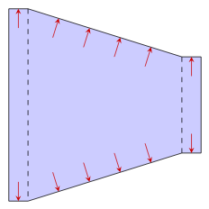
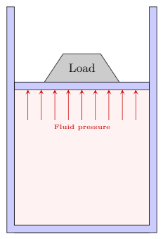

$$
\require{cancel}
\newcommand{\s}{\mathrm{s}}
\newcommand{\min}{\mathrm{min}}
\newcommand{\hr}{\mathrm{hr}}
\newcommand{\kg}{\mathrm{kg}}
\newcommand{\kN}{\mathrm{kN}}
\newcommand{\inch}{\mathrm{in}}
\newcommand{\ft}{\mathrm{ft}}
\newcommand{\m}{\mathrm{m}}
\newcommand{\mm}{\mathrm{mm}}
\newcommand{\km}{\mathrm{km}}
\newcommand{\mi}{\mathrm{mi}}
\newcommand{\cm}{\mathrm{cm}}
\newcommand{\lb}{\mathrm{lb}}
\newcommand{\lbm}{\mathrm{lbm}}
\newcommand{\lbf}{\mathrm{lbf}}
\newcommand{\gal}{\mathrm{gal}}
\newcommand{\L}{\mathrm{L}}
\newcommand{\N}{\mathrm{N}}
\newcommand{\slug}{\mathrm{slugs}}
\newcommand{\Pa}{\mathrm{Pa}}
\newcommand{\mph}{\mathrm{mph}}
\renewcommand{\psi}{\mathrm{psi}}
\newcommand{\C}{^\circ\mathrm{C}}
\newcommand{\F}{^\circ\mathrm{F}}
\newcommand{\sg}{\mathrm{sg}}
$$

# The nature of fluids
{:.no_toc}

* A markdown unordered list for the toc
{:toc}

A *fluid* is a substance that continually deforms or flows under an applied shear stress.  Both liquids and gases fit this description and the word fluid can refer to either a liquid or a gas.  What is the dividing line between a gas and a liquid if they are both fluids?  For this course, our working definition of a *liquid* is a fluid that is incompressible ([see below](#compressibility)) and a *gas* is a fluid that is compressible.  Again, that will be our working definition *for this course*.  The sections below will go through a number of physical properties that are commonly used to characterize fluids.

## Density, specific weight & specific gravity

### Density

The *density* of a fluid is its mass per unit volume,

$$
\textrm{density}=\textrm{mass}/\textrm{Volume}\,.\\
$$

The density is represented by the Greek letter rho ($\rho$).  If a quantity of fluid has a mass $m$ and a volume $V$ its density is

$$
\rho=m/V\,.
$$

The units for density are $\kg/\m^3$ in the SI system and $\slug/\ft^3$ in the U.S. Customary System.

### Specific weight

The *specific weight* of a fluid is its weight per unit volume,

$$
\textrm{specific weight}=\textrm{weight}/\textrm{Volume}\,.\\
$$

The specific weight is represented by the Greek letter gamma ($\gamma$).  If a quantity of fluid has a weight $w$ and a volume $V$ its specific weight is

$$
\gamma=w/V\,.
$$

The units for specific weight are $\N/\m^3$ in the SI system and $\lb/\ft^3$ in the U.S. Customary System.

It is straightforward to convert between density and specific weight.  Since the weight of a fluid is just its mass times gravity, $w=mg$ ($g$ being the acceleration due to gravity), the specific weight can be computed from the density with

$$
\gamma=\rho g\,.
$$

### Specific gravity

It is often convenient to report the density of a fluid with respect to a given reference fluid.  A common choice of reference fluid is water at a temperature of $4\C$ and this is what will be used throughout this course unless specified otherwise.   Two quantities you will come to memorize is the density of water at this temperature in the SI and US system of units:   

$$
\begin{align*}
\textrm{density of water at}~4\C:  &&
\renewcommand\arraystretch{1.3}
\begin{array}{@{}l@{\hskip 0.5in}c}
\rho=1000~\text{kg}/\text{m}^3 & \textrm{SI}\\  \rho=1.94~\text{slugs}/\text{ft}^3 & \textrm{USCS}
\end{array}  
\end{align*}
$$

The specific gravity of a substance is then defined by the substance's density divided by the density of water at $4\C$:

$$
\sg=\frac{\rho}{1000~\kg/\m^3}\quad \textrm{SI}\,, \qquad\qquad
\sg=\frac{\rho}{1.94~\slug/\ft^3} \quad \textrm{USCS}
$$

Note that when computing the specific gravity of a substance you always divide by the density of water at $4\C$ regardless of the temperature of the substance.  Also, note that some industries use water at a temperature of $15.6\C$ as a reference.  The density of water at this slightly higher temperature is smaller by less than a tenth of a percent and will make little difference in practical applications.

Alternatively, the specific weight can be used to calculate the specific gravity.  In this case the specific gravity is defined as the substance's specific weight divided by the specific weight of water at $4\C$:

$$
\begin{align*}
\textrm{specific weight of water at}~4\C:  &&
\renewcommand\arraystretch{1.3}
\begin{array}{@{}l@{\hskip 0.5in}c}
\gamma=9.81~\text{kN}/\text{m}^3 & \textrm{SI}\\  \gamma=62.4~\text{lb}/\text{ft}^3 & \textrm{USCS}
\end{array}  
\end{align*}
$$

And the specific gravity (sg) of a fluid can be computed from its specific weight ($\gamma$) with

$$
\sg=\frac{\gamma}{9.81~\kN/\m^3}\quad \textrm{SI}\,, \qquad\qquad
\sg=\frac{\gamma}{62.4~\lb/\ft^3} \quad \textrm{USCS}
$$

Note that the two definitions for the specific gravity (the one using density and the one using specific weight) are equivalent.   This is because specific weight is just the density times $g$ and the factor of $g$ cancels in the above ratios.  The example below will explicitly illustrate this.

The specific gravity of a fluid is dimensionless. Don't get confused, the three quantities (density, specific weight and specific gravity) are three ways of representing the same thing (the amount of fluid per unit volume).  The following examples will demonstrate how these concepts are related.

An oil barrel has a volume of $0.16~\m^3$ and a mass of $140~\kg$.  Compute the weight of the barrel.  Then compute the density, specific weight and specific gravity of the oil.  

To compute the weight we use $w=mg$ where $g=9.81~\m/s^2$.  We have

$$
w=140~\kg\times 9.81~\m/s^2=1373~\kg\cdot\m/s^2
$$

A $\kg\cdot\m/s^2$ is a Newton (N) and the weight is therefore

$$
w=1373~\N=1.373\times 10^3~\N=1.373~\kN
$$

The density is the mass of the oil divided by the volume of oil.

$$
\rho=\frac{m}{V}=\frac{140~\kg}{0.16~\m^3}=875~\frac{\kg}{\m^3}
$$

The specific weight is the weight of the oil divided by the volume of oil.

$$
\gamma=\frac{w}{V}=\frac{1.373~\kN}{0.16~\m^3}=8.581~\frac{\kN}{\m^3}
$$

We can solve for the specific gravity by dividing the oil's density (or specific weight) with that of water at $4\C$.  Both should yield the same result.

$$
\sg=\frac{\rho}{1000~\kg/\m^3}=\frac{875~\kg/\m^3}{1000~\kg/\m^3}=0.875
$$

or equivalently

$$
\sg=\frac{\gamma}{9.81~\kN/\m^3}=\frac{8.581~\kN/\m^3}{9.81~\kN/\m^3}=0.875
$$

The units cancel when computing the specific gravity leaving us with a dimensionless quantity as expected.

Glycerine at $77\F$ has a specific gravity of 1.263.  Compute its density and specific weight.  How much does a gallon of Glycerine weigh?

Since Fahrenheit was used in the statement of the problem it makes sense to work in the US system of units.  The density and specific weight can be found by multiplying the given specific gravity of Glycerine with the density and specific weight of water at $4\C$.  First compute the density:

$$
\rho=\sg\times 1.94~\slug/\ft^3=1.263\times 1.94~\slug/\ft^3=2.45~\slug/\ft^3
$$

And now the specific weight:

$$
\gamma=\sg\times 62.4~\lb/\ft^3=1.263\times 62.4~\lb/\ft^3=78.81~\lb/\ft^3
$$

To find the weight of a gallon of Glycerine we use the relation $\gamma=w/V$ and solve for $w$:

$$
w=\gamma \times V = 78.81~\frac{\lb}{\cancel{\ft^3}}\times 1~\cancel{\text{gal}}\left( \frac{\cancel{\ft^3}}{7.48~\cancel{\text{gal}}}\right)=10.5~\lb
$$

### API gravity

The petroleum industry uses its own measure for density of petroleum products called *API gravity*.  API stands for the American Petroleum Institute.  API gravity is calculated from the specific gravity of an oil with

$$
\textrm{API gravity} = \frac{141.5}{\textrm{sg}}-131.5
$$

While these API values do not have units they are often referred to as degrees (deg API).  API gravity is inversely related to specific gravity.  So the lower the oil's API gravity the higher its density.  If the API gravity is given the specific gravity can be found with

$$
\textrm{sg} = \frac{141.5}{131.5+\textrm{API gravity}}
$$

Note, that the specific gravity in this context uses a reference temperature of $60\F$.  From the above definition of API gravity we can calculate that an oil having the same density of water (*i.e.* sg=1) has an API gravity of
$
\frac{141.5}{1.0}-131.5=10^\circ \textrm{API}
$

This is very heavy for an oil.  Oil having an API gravity at or below $10^\circ$ API are usually classified as "extra heavy oil".  "Medium oils" are around $20^\circ$ API and "light oils" around $45^\circ$ API.  Remember, the higher the API the lower the density (Any oil with an API greater than $10^\circ$ will float on water).

In the worldwide oil industry an oil barrel has a volume of 42 US gallons.  On the European stock exchange companies often report their production as a mass of oil in metric tons (1 metric ton = 1000 kg).   

Western Canadian Select is a heavy crude oil with an API gravity of $20.5^\circ$.  Compute the number of barrels needed to hold a metric ton of  Western Canadian Select.

The above problem is asking us to find the volume of 1000 kg of a type of heavy crude oil.  First, let us use the API gravity to find the specific gravity of the oil.

$$
\textrm{sg} = \frac{141.5}{131.5+\textrm{API gravity}}= \frac{141.5}{131.5+20.5}=0.931\,.
$$

Now that we have the specific gravity we can find the density,

$$
\rho = \sg\times\left(1000~\kg/\m^3\right)=931~\kg/\m^3\,,
$$

and next the volume

$$
V=\frac{m}{\rho}=\frac{1000~\kg}{931~\kg/\m^3}=1.074~\m^3\,.
$$

Now the last part might be the trickiest.  We need to convert the above volume of $1.074~\m^3$ into a number of barrels.  I do this by a careful cancellation of units as follows.

$$
V=1.074~\m^3\times\left(\frac{1000~ \L}{\m^3}\right)\times\left(\frac{\gal}{3.785~\L}\right)\times\left(\frac{1~\text{barrels}}{42~\gal}\right)=6.76~\text{barrels}
$$

There is a closely related scale called the <a href="https://en.wikipedia.org/wiki/Baum%C3%A9_scale">Baumé scale</a>.  It is very similar to to API gravity scale but has different definitions depending on whether the liquid's density is less than or greater than that of water.  I won't go into the details here as using API gravity is preferred.  But if you see a substance (typically a petroleum product) reported in degrees Baumé, it is yet another way of reporting the specific gravity.

## Pressure

*Pressure* if the force applied perpendicular to a surface per unit area.

$$
\textrm{Pressure}=\frac{\textrm{Force}}{\textrm{Area}} \qquad\qquad p=\frac{F}{A}
$$

For this definition to work the area must be small enough so that the force is uniformly distributed over that area.  The standard unit of pressure in the SI system is $\N/\m^2$ and has its own name, the pascal (Pa).  The standard unit of pressure in the US system is $\lb/\ft^2$ but is rarely used.  Instead,  $\lb/\inch^2$, abbreviated psi, is used most often.

A package of dimension $1~\ft\times 1~\ft\times 1~\ft$ that weighs 36 pounds
rests on a table.  What pressure does the package exert on the table?    

We assume that the weight of the package is uniformly distributed.  The pressure is given as

$$
p=\frac{F}{A} = \frac{36~\lb}{(1~\ft)^2} = 36~\lb/\ft^2 =36~\rm{psf}
$$

So our answer is 36 psf (pounds per square foot).  However, this unit is rarely used so convert to the usual psi:

$$
p=36\frac{\lb}{\ft^2}\times\left(\frac{1~\ft}{12~\inch}\right)^2=0.25~\psi
$$

A fluid (gas or liquid) exerts a pressure on objects they are in contact with.  This pressure is created by the molecules of the fluid impacting the confining container.  Note that this pressure acts internally on the fluid itself as well.  For a static (not moving) fluid there are two important principals

1.  Pressure acts uniformly on a small volume of fluid
2.  Pressure acts perpendicular to its confining boundary

  
  

  The pressure acting on a small volume of fluid acts uniformly in all directions.
  

  
  
  
  
  

  Direction of the force exerted by the fluid pressure on various boundaries.  Left to right: Fluid power cylinder, pipe or tube, heat exchanger consisting of a pipe inside another pipe, reducer used in an HVAC system
  

<table style="border:0;">
<tr><td>

</td><td>
A cylinder containing a liquid with a movable piston supports a load of $200~\N$.  What is the pressure in the liquid under the piston of area $2500~\mm^2$.  Neglect the weight of the piston.
</td></tr></table>

Here is my solution

## Compressibility

$$
K=\frac{-\Delta p}{(\Delta V)/V}
$$

## Vapor pressure

Imagine you have a sealed container half filled with water.  Some of the water molecules will have sufficient kinetic energy to escape from the surface (evaporate) and other molecules following their escape will re-enter the liquid (condense).  Over time the system will reach a steady-state where the rates of evaporation and condensation are the same.  In equilibrium, the pressure exerted by the vapor on the liquid is called the *vapor pressure*.  It is a property of the fluid and it value will depend on the fluid's temperature.  

For example, at room temperature the vapor pressure of water is about 2.4 kPa.  If the ambient pressure is brought below this value water will boil at room temperature as shown in the following movie.

<iframe width="560" height="315" src="https://www.youtube.com/embed/739990nm0QY" frameborder="0" allow="autoplay; encrypted-media" allowfullscreen></iframe>

Plainfield Chemistry - Water Boiling at Room Temperature

The consideration of vapor pressure will be of particular importance in this class due to a phenomenon know as *cavitation*.  In a hydraulic system, such as those containing pumps and pipelines, if the fluid pressure drops below the vapor pressure local boiling can occur and vapor bubbles will form in the fluid.  If these bubbles move into a region of high pressure they can collapse producing large forces on nearby solid surfaces.  These cavitation bubbles are strong enough to erode the metal surfaces of hydraulic machinery such as pumps, turbines and propellers (see picture below).  As long as the fluid pressure can be maintained is kept above the vapor pressure in a closed hydraulic system cavitation can be avoided.

  
  

  Cavitation damage evident on the propeller of a personal watercraft. Note the concentrated damage on the outer edge of the propeller where the speed of the blade is fastest.  

  By Erik Axdahl (The original uploader was Axda0002 at English Wikipedia.) (Original text: Erik Axdahl en:User:Axda0002) [<a href="https://creativecommons.org/licenses/by-sa/2.5">CC BY-SA 2.5</a>], via Wikimedia Commons
  

## Surface tension

The molecules of a liquid attract each other.  For example, in water hydrogen bonds result in a strong cohesive force among the water molecules.  In the bulk of the water these molecular interactions are balanced in all directions.  However, at the surface there is an imbalance and the water molecules cohere more strongly to the neighboring molecules resulting in apparent film at the surface.  It is more difficult to move an object through the surface than to move it through the fluid when fully immersed.

  
  

  A water strider supported on the surface of water by surface tension.
  

$$
\rm{Surface tension}=\frac{\rm{work}}{\rm{area}}
$$

## Viscosity

A fluid's *viscosity* is a measure of the fluid's resistance to motion under an applied shear force.  When you stir a pot of honey the spoon generates the "applied shear force".  The difficulty in moving the spoon due to the fluid's resistance is a specific property of the honey, *i.e.* the honey's viscosity.  

In the following sections we will introduce two different (but very closely related) definitions of the viscosity.  The *dynamic viscosity* will be represented by the Greek letter eta ($\eta$).  Imagine you have a tube or pipe (or drinking straw) held horizontally with a fluid inside.  You blow into the tube in order to move the fluid a certain distance.  The amount of force required to perform this task will depend on the fluid's dynamic viscosity.

The second definition of viscosity is called the *kinematic viscosity* and will be represented by the Greek letter nu ($\nu$).  Imagine a tank filled with a liquid that has a crack or small opening.  The amount of time it takes for the liquid to leak or drain from the tank under its own weight will depend on the fluid's kinematic viscosity.

### Dynamic Viscosity

We start off in the same way as every other fluids textbook.  Imagine two flat surfaces separated by the fluid of interest.  The plates are large so that we can ignore what is going on at the edges.  A force $F$ is applied to the upper surface in order for it to maintain a constant velocity $v$.  The lower surface remains stationary.  The distance between the surfaces (the thickness of the layer of fluid) is $y$.  Here is a picture of the setup I have in mind.

  
  

  Velocity profile of a thin layer of fluid between to parallel plates (known as Couette Flow).
  

The upper plate creates an applied shear stress of magnitude $\tau=F/A$, where $A$ is the contact area between the fluid and plate.  This applied shear stress continuously deforms the fluid.

So what is the fluid doing between these two plates; one stationary, one moving. Well, a basic condition, which we state without justification, is that a fluid in contact with a surface has the same velocity as that surface.  This is known as the *no-slip condition*.  Therefore, the velocity of the fluid in contact with the bottom plate is zero and the velocity of the fluid in contact with the top plate is $v$.

If the thickness of the fluid is small we assume that the velocity increases from the lower stationary plate to the upper moving plate in a straight-line (linear) fashion.  This rate-of-change in velocity from the bottom plate to the top is known as the *shear rate* or *velocity gradient* or *strain* and expressed as $\Delta v/\Delta y$ (*i.e.* it's the slope of the velocity profile).  The shear rate is often written as $\dot{\gamma}$ (the Greek letter gamma with a dot--the dot represents a derivative) and has units $1/s$ (*i.e.* reciprocal seconds or inverse seconds).

The amount of applied shear stress that is necessary to generate a certain strain is a measure of the fluids viscosity.  For example, the external force required to generate the same upper-plate velocity in honey and water would be much larger for the honey (the honey is more viscous).

In practice a series of measurements would be performed where the external force (applied shear stress) is varied and the resultant strain rates recorded.  The graph below shows the results of such an experiment using Olive Oil.  Each data point (square) represents one such measurement.  For each applied shear stress (y-axis) there is one corresponding shear rate (x-axis).  

  
  

  Rheogram for Olive Oil -- a Newtonian fluid -- at $40\C$. Data from <a href="https://sites.google.com/site/jfsteffe/">Steffe</a>.
  

One readily observes a linear relationship between the stress and strain for this particular fluid.   A fluid that exhibits this type of behavior is known as *Newtonian*.  The slope of the line in the stress-strain curve is known as the *dynamic* or *absolute viscosity*.  For a Newtonian fluid we therefore have

$$
\tau=\eta \left(\frac{\Delta v}{\Delta y}\right)
$$

where $\eta$ (Greek letter eta) is the dynamic viscosity, $\tau$ is the applied shear stress and $\Delta v/\Delta y$ is the shear rate.  

The dynamic viscosity has units of $\Pa\cdot s$ in the SI system and $\lb \cdot s/\ft^2$ in the US system.  Coming back to our example of Olive Oil we see that it has a dynamic viscosity of $\eta=0.0363\,\Pa \cdot s$.  

In many fluid property resources the dynamic viscosity will be given in an older unit call the centipoise (cP).  A centipoise is equivalent to a milli-Pa$\cdot s$ which is $1.0\times 10^{-3}\,\Pa\cdot s$.  The viscosity of the Olive Oil considered above has a dynamic viscosity of $\eta=36.3~{\rm cP}$.

### Kinematic Viscosity

The *kinematic viscosity*, represented by the Greek letter nu ($\nu$) is defined as the ratio of the dynamic viscosity over the density of the fluid.

$$
\nu=\frac{\eta}{\rho}
$$

The reason for introducing the kinematic viscosity is that many calculations will end up involving precisely this ratio.  Based on the definition given above the units for kinematic viscosity in the SI system is $m^2/s$ and in the US system $\ft^2/s$.  Kinematic viscosities are oftentimes reported in an older unit called the centistoke (cSt) which is $1.0\times 10^{-6}\,\m^2/s=1~\mm^2/s$.

Returning to the example of olive oil.  If its density is $930~\N/\m^3$ its kinematic viscosity is
$$
\nu=\frac{0.0363\,\Pa \cdot s}{930~\kg/\m^3}=3.9\times 10^{-5}~\frac{\m^2}{s}=39~\rm{cSt}
$$

It is worth taking a minute to show how the units worked out.  A

### Non-Newtonian fluids

The previous section described a fluid as Newtonian if there was a linear relationship between the applied stress and resulting strain.  This is an idealization and while it serves as a reasonable description of many of the fluids we will encounter other fluids are not so simple.

  
  

  

  
  

  

### Temperature Dependence of Viscosity

The viscosity of a fluid can change drastically with temperature.  As far as I'm aware, all liquids experience a decrease in viscosity with an increase in temperature.  Think of motor oil, which is difficult to pour when cold but flows easily when the temperature is increased.  Gases follow the opposite trend, their viscosity increases with increasing temperature. Note that the viscosity of gases tend to be less sensitive to temperature changes than liquids.   The figure below shows the temperature dependence of the dynamic viscosity of liquid water (curve below $100\C$) and water-vapor (curve above $100\C$).

  
  

Dynamic viscosity of liquid water and water-vapor on a log-linear plot.
  

The *viscosity index* ($VI$) of a liquid is a measure of how greatly the kinematic viscosity varies with temperature.  It is an important property of hydraulic fluids and lubricants that operate at a wide range in temperatures.  A liquid with a low $VI$ exhibits a large relative change in viscosity with temperature.  A liquid with a high $VI$ is less sensitive to temperature variations.  The viscosity index is a dimensionless quantity that was originally setup to be measured on a scale from 0 to 100.   But since the scale's conception there a variety of lubricants have been designed that can reach a $VI$ of over 400.

  
  

Kinematic viscosity for an ISO VG 100 lubricant for a viscosity index of 50 (red), 100 (blue), and 150 (black).  An ISO VG 100 has a kinematic viscosity of 100 cSt at $40\C$.
  

https://wiki.anton-paar.com/en/calculators/

### SAE Viscosity Grades

The internal combustion engine has many parts that move against each other.  Motor oil acts as a lubricant by creating a thin film between surfaces of adjacent moving parts.  

The main concern regarding motor oils is their viscosity.  If the oil's viscosity is too high, the lubricant may not flow to where it is needed.  If the viscosity is too low  the fluid might not sufficiently separate and protect the parts as intended.

The SAE International had developed a rating system for engine oils and automotive gear lubricants.  Kinematic viscosity is the main

The Society of Automotive Engineers has a classification system for engine oils and gear lubricants (transmission fluid).  There are two separate classes of oils, monograde and multigrade.  First let us describe monogrades of which there are two types.  There are "straight" grades defined by their viscosities at high temperatures and "W" grades (the "W" stands for winter) which puts further constraints on their lower temperature viscosities.

The straight grades include: 20, 30, 40, 50, and 60.  For an oil to be classified as one of these the kinematic viscosity must fall within a certain range at $100\C$ and have a minimum kinematic viscosity at $150\C$ tested at a high shear rate.  Both viscosities are tested using standards set by ASTM international.  For example SAE 30 must have a kinematic viscosity between 5.6 and 9.3 $\mm^2/s$ at $100\C$ and a kinematic viscosity larger than 2.6 $\mm^2/s$ at $150\C$.  The winter grades include:  0W, 5W, 10W, 15W, 20W, 25W.  For the winter grades there is no requirement at $150\C$ and only a minimum kinematic viscosity at $100\C$.  In addition there are maximums set on the dynamic viscosity at low temperatures (below freezing).  For example, a SAE 15W oil must have a dynamic viscosity less than $7000~\m\Pa/s$ at $-20\C$ and less than $60,000~\m\Pa/s$ at $-25\C$ and a kinematic viscosity larger than $5.6~\mm^2/s$ at $100\C$.

Multigrade oils must satisify both the low and high temperature reuiresments.  For example, SAE 15W-30 must satisify the the SAE15W conditions at cold temperature sand the SAE30 conditions at high temperatures.

[SAE](http://www.tribology-abc.com/abc/viscosity.htm#SAE)
https://wiki.anton-paar.com/en/sae-viscosity-grades/

The grades for gear oils include: 70W, 75W, 80W, 85W, 80, 85, 90, 110, 140, 190, 250.  The height weights or grades for gear oils have nothing to do with them being heavier or more viscous.  The numbers are simply a classification scheme.  Note that the stanard tests for gear oils are different.

http://www.tribology-abc.com/abc/viscosity.htm#SAE306

### ISO Viscosity Grades

For industrial applications it is recommended to use the ISO viscosity classification.  Each ISO viscosity grade requires the oil to have a specified kinematic viscosity at a temperature of $40\C$.  

For example and ISO VG 150 must have a kinematic viscosity within 10% of 100 $\mm^2/s$ at $40\C$.  And ISO VG 10 must  have a kinematic viscosity within 10% of 10 $\mm^2/s$ at $40\C$.

[ISO](http://www.tribology-abc.com/abc/viscosity.htm#SI)

The viscosity of the oil at different temperatures can be approximated by using its viscosity at $40\C$ along with its viscosity index (VI).

### Viscosity Measurement

References:

%\bibitem{Kestin84} Kestin, J.; Sengers, J.V.; Kamgar-Parsi, B.; Levelt Sengers, J.M.H., Thermophysical Properties of Fluid H2O, J. Phys. Chem. Ref. Data, 1984, 13, 1, 175-183. [doi:10.1063/1.555707]
%\url{http://webbook.nist.gov/chemistry/fluid/}

%\bibitem{Dixon07}
%Dixon, John C., The Shock Absorber Handbook, John Wiley \& Sons, Ltd. (2007)
%\url{http://dx.doi.org/10.1002/9780470516430.app2}
