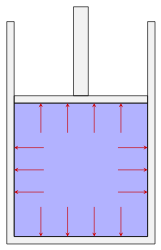
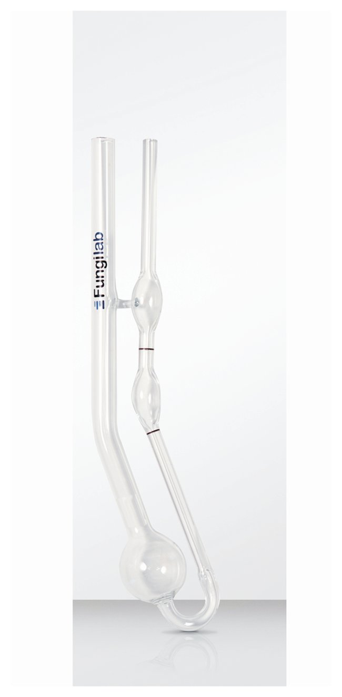

$$
\require{cancel}
\newcommand{\s}{\mathrm{s}}
\newcommand{\min}{\mathrm{min}}
\newcommand{\hr}{\mathrm{hr}}
\newcommand{\kg}{\mathrm{kg}}
\newcommand{\kN}{\mathrm{kN}}
\newcommand{\inch}{\mathrm{in}}
\newcommand{\ft}{\mathrm{ft}}
\newcommand{\m}{\mathrm{m}}
\newcommand{\mm}{\mathrm{mm}}
\newcommand{\km}{\mathrm{km}}
\newcommand{\mi}{\mathrm{mi}}
\newcommand{\cm}{\mathrm{cm}}
\newcommand{\lb}{\mathrm{lb}}
\newcommand{\lbm}{\mathrm{lbm}}
\newcommand{\lbf}{\mathrm{lbf}}
\newcommand{\gal}{\mathrm{gal}}
\newcommand{\L}{\mathrm{L}}
\newcommand{\N}{\mathrm{N}}
\newcommand{\slug}{\mathrm{slugs}}
\newcommand{\Pa}{\mathrm{Pa}}
\newcommand{\kPa}{\mathrm{kPa}}
\newcommand{\MPa}{\mathrm{MPa}}
\newcommand{\mph}{\mathrm{mph}}
\renewcommand{\psi}{\mathrm{psi}}
\newcommand{\C}{^\circ\mathrm{C}}
\newcommand{\F}{^\circ\mathrm{F}}
\newcommand{\sg}{\mathrm{sg}}
$$

# The nature of fluids
{:.no_toc}

* A markdown unordered list for the toc
{:toc}

A *fluid* is a substance that continually deforms or flows under an applied shear stress.  Both liquids and gases fit this description and the word fluid refers to either.  What differentiates a gas from a liquid if both are fluids?  For this course, our working definition of a *liquid* is a fluid that is incompressible ([see below](#compressibility)) and a *gas* is a fluid that is compressible.  Again, that is our working definition *for this course*.  

The sections below go through a number of physical properties that are commonly used to characterize fluids.

## Density, specific weight & specific gravity

### Density

The *density* of a fluid is its mass per unit volume,

$$
\mathrm{density}=\mathrm{mass}/\mathrm{Volume}\,.\\
$$

The density is represented by the Greek letter rho ($\rho$).  If a quantity of fluid has a mass $m$ and a volume $V$ its density is

$$
\rho=m/V\,.
$$

The units for density are $\kg/\m^3$ in the SI system and $\slug/\ft^3$ in the U.S. Customary System.

### Specific weight

The *specific weight* of a fluid is its weight per unit volume,

$$
\mathrm{specific~weight}=\mathrm{weight}/\mathrm{Volume}\,.\\
$$

The specific weight is represented by the Greek letter gamma ($\gamma$).  If a quantity of fluid has a weight $w$ and a volume $V$ its specific weight is

$$
\gamma=w/V\,.
$$

The units for specific weight are $\N/\m^3$ in the SI system and $\lb/\ft^3$ in the U.S. Customary System.

It is straightforward to convert between density and specific weight.  Since the weight of a fluid is just its mass times gravity, $w=mg$ ($g$ being the acceleration due to gravity), the specific weight can be computed from the density using

$$
\gamma=\rho g\,.
$$

### Specific gravity

It is often convenient to report the density of a fluid with respect to a given reference fluid.  A common choice of reference fluid is water at a temperature of $4\C$.  We will use this as our reference fluid unless specified otherwise.   Two quantities you will come to memorize are the density of water at this temperature in the SI and US system of units:   

$$
\begin{align*}
\mathrm{density~of~water~at}~4\C:  &&
\renewcommand\arraystretch{1.3}
\begin{array}{@{}l@{\hskip 0.5in}c}
\rho=1000~\text{kg}/\text{m}^3 & \mathrm{SI}\\  \rho=1.94~\text{slugs}/\text{ft}^3 & \mathrm{USCS}
\end{array}  
\end{align*}
$$

The specific gravity of a substance is then defined as the substance's density divided by the density of water at $4\C$:

$$
\sg=\frac{\rho}{1000~\kg/\m^3}\quad \mathrm{SI}\,, \qquad\qquad
\sg=\frac{\rho}{1.94~\slug/\ft^3} \quad \mathrm{USCS}
$$

Note that when computing the specific gravity of a substance you always divide by the density of water at its reference temperature (here $4\C$) regardless of the temperature of the substance.  Some industries use water at a temperature of $15.6\C$ as a reference.  The density of water at this slightly higher temperature is smaller by less than a tenth of a percent and will make little difference in practical applications.

Alternatively, the specific weight can be used to calculate the specific gravity.  In this case the specific gravity is defined as the substance's specific weight divided by the specific weight of water at $4\C$:

$$
\begin{align*}
\mathrm{specific~weight~of~water~at}~4\C:  &&
\renewcommand\arraystretch{1.3}
\begin{array}{@{}l@{\hskip 0.5in}c}
\gamma=9.81~\text{kN}/\text{m}^3 & \mathrm{SI}\\  \gamma=62.4~\text{lb}/\text{ft}^3 & \mathrm{USCS}
\end{array}  
\end{align*}
$$

And the specific gravity (sg) of a fluid can be computed from its specific weight ($\gamma$) using

$$
\sg=\frac{\gamma}{9.81~\kN/\m^3}\quad \mathrm{SI}\,, \qquad\qquad
\sg=\frac{\gamma}{62.4~\lb/\ft^3} \quad \mathrm{USCS}
$$

Note that the two definitions for the specific gravity (the one using density and the one using specific weight) are equivalent.   This is because specific weight is just the density times $g$ and the factor of $g$ cancels in the above ratios.  The example below will illustrate this.

The specific gravity of a fluid is dimensionless. Don't get confused, the three quantities (density, specific weight and specific gravity) are three ways of representing the same thing (the amount of fluid per unit volume).  The following examples demonstrate how these concepts are related.

An oil barrel has a volume of $0.16~\m^3$ and a mass of $140~\kg$.  Compute the weight of the barrel.  Then compute the density, specific weight and specific gravity of the oil.  

To compute the weight use $w=mg$ where $g=9.81~\m/s^2$.  We have

$$
w=140~\kg\times 9.81~\m/s^2=1373~\kg\cdot\m/s^2
$$

A $\kg\cdot\m/s^2$ is a Newton (N) and the weight is therefore

$$
w=1373~\N=1.373\times 10^3~\N=1.373~\kN
$$

The density is the mass of the oil divided by the volume of oil.

$$
\rho=\frac{m}{V}=\frac{140~\kg}{0.16~\m^3}=875~\frac{\kg}{\m^3}
$$

The specific weight is the weight of the oil divided by the volume of oil.

$$
\gamma=\frac{w}{V}=\frac{1.373~\kN}{0.16~\m^3}=8.581~\frac{\kN}{\m^3}
$$

We can solve for the specific gravity by dividing the oil's density (or specific weight) with that of water at $4\C$.  Both should yield the same result.

$$
\sg=\frac{\rho}{1000~\kg/\m^3}=\frac{875~\kg/\m^3}{1000~\kg/\m^3}=0.875
$$

or equivalently

$$
\sg=\frac{\gamma}{9.81~\kN/\m^3}=\frac{8.581~\kN/\m^3}{9.81~\kN/\m^3}=0.875
$$

The units cancel when computing the specific gravity leaving us with a dimensionless quantity as expected.

Glycerine at $77\F$ has a specific gravity of 1.263.  Compute its density and specific weight.  How much does a gallon of Glycerine weigh?

Since Fahrenheit was used in the statement of the problem we will work in the US system of units.  The density and specific weight can be found by multiplying the given specific gravity of Glycerine with the density and specific weight of water at $4\C$.  First compute the density:

$$
\rho=\sg\times 1.94~\slug/\ft^3=1.263\times 1.94~\slug/\ft^3=2.45~\slug/\ft^3
$$

And then the specific weight:

$$
\gamma=\sg\times 62.4~\lb/\ft^3=1.263\times 62.4~\lb/\ft^3=78.81~\lb/\ft^3
$$

To find the weight of a gallon of Glycerine we use the relation $\gamma=w/V$ and solve for $w$:

$$
w=\gamma \times V = 78.81~\frac{\lb}{\cancel{\ft^3}}\times 1~\cancel{\text{gal}}\left( \frac{\cancel{\ft^3}}{7.48~\cancel{\text{gal}}}\right)=10.5~\lb
$$

### API gravity

The petroleum industry uses its own measure for density of petroleum products called *API gravity*.  API stands for the American Petroleum Institute.  API gravity is calculated from the specific gravity of an oil using

$$
\mathrm{API~gravity} = \frac{141.5}{\mathrm{sg}}-131.5
$$

Even though API values are dimensionless they are often quoted as degrees (deg API).  API gravity is inversely related to specific gravity; the lower the oil's API gravity the higher its density.  If the API gravity is given the specific gravity can be found with

$$
\mathrm{sg} = \frac{141.5}{131.5+\mathrm{API~gravity}}
$$

Note, that the specific gravity in this context uses a reference temperature of $60\F$.  From the above definition of API gravity we can calculate that an oil having the same density of water (*i.e.* sg=1) has an API gravity of,

$$
\mathrm{API~gravity~of~water}=\frac{141.5}{1.0}-131.5=10^\circ \mathrm{API}
$$

This is very heavy for an oil.  Oil having an API gravity at or below $10^\circ$ API are usually classified as "extra heavy oil".  "Medium oils" are around $20^\circ$ API and "light oils" around $45^\circ$ API.  Remember, the higher the API the lower the density (Any oil with an API greater than $10^\circ$ will float on water).

In the worldwide oil industry an oil barrel has a volume of 42 US gallons.  On the European stock exchange companies often report their production as a mass of oil in metric tons (1 metric ton = 1000 kg).   

Western Canadian Select is a heavy crude oil with an API gravity of $20.5^\circ$.  Compute the number of barrels needed to hold a metric ton of  Western Canadian Select.

The problem is asking us to find the volume of 1000 kg of a specific type of heavy crude oil.  First, let us use the API gravity to find the specific gravity of the oil.

$$
\mathrm{sg} = \frac{141.5}{131.5+\mathrm{API~gravity}}= \frac{141.5}{131.5+20.5}=0.931\,.
$$

Now that we have the specific gravity we can find the density,

$$
\rho = \sg\times\left(1000~\kg/\m^3\right)=931~\kg/\m^3\,,
$$

and next the volume

$$
V=\frac{m}{\rho}=\frac{1000~\kg}{931~\kg/\m^3}=1.074~\m^3\,.
$$

Now the last part might be the trickiest.  We need to convert the above volume of $1.074~\m^3$ into a number of barrels.  I do this by a careful cancellation of units as follows.

$$
V=1.074~\m^3\times\left(\frac{1000~ \L}{\m^3}\right)\times\left(\frac{\gal}{3.785~\L}\right)\times\left(\frac{1~\mathrm{barrels}}{42~\gal}\right)=6.76~\mathrm{barrels}
$$

There is a closely related scale called the <a href="https://en.wikipedia.org/wiki/Baum%C3%A9_scale">Baumé scale</a>.  It is very similar to the API gravity scale but has different definitions depending on whether the liquid's density is greater or less than that of water.  I won't go into the details here as using API gravity is preferred.  But if you see a substance (typically a petroleum product) reported in degrees Baumé, it is yet another way of reporting the specific gravity.

## Pressure

*Pressure* is the force applied perpendicular to a surface per unit area.

$$
\mathrm{Pressure}=\frac{\mathrm{Force}}{\mathrm{Area}}\, \qquad\qquad p=\frac{F}{A}
$$

For this definition to work the area must be small enough so that the force is uniformly distributed over that area.  The standard unit of pressure in the SI system is $\N/\m^2$ and has its own name, the pascal (Pa).  The standard unit of pressure in the US system is $\lb/\ft^2$ but is rarely used.  Instead,  $\lb/\inch^2$, abbreviated psi, is the standard.  Note that pressure is a scalar quantity; it has a magnitude but no direction.  Of course, the force generated from the pressure on an object has both a magnitude and direction.
You will oftentimes hear that the fluid pressure acts in a certain direction and while the intended meaning is clear you should remind yourself (not others) that pressure is actually a scalar quantity and has no direction.

A package of dimension $1~\ft\times 1~\ft\times 1~\ft$ weighing 36 pounds
rests on a table.  What pressure does the package exert on the table?    

We assume that the weight of the package is uniformly distributed.  The pressure is given as

$$
p=\frac{F}{A} = \frac{36~\lb}{(1~\ft)^2} = 36~\lb/\ft^2 =36~\rm{psf}
$$

So our answer is 36 psf (pounds per square foot).  However, this unit is rarely used so convert to the usual psi:

$$
p=36\frac{\lb}{\ft^2}\times\left(\frac{1~\ft}{12~\inch}\right)^2=0.25~\psi
$$

A fluid (gas or liquid) exerts pressure on any object it's in contact with including its confining container.  Pressure is generated by the collisions of the fluid's molecules with the walls of the container. Each molecule that bounces off the fluid's container transfers a bit of momentum.  Averaging over the billions of collisions occurring each second results in a net force per unit area (pressure) acting on the wall.  The pressure acts perpendicular to its confining boundary.

  
  
  
  
  

  Direction of the force exerted by the fluid pressure on various boundaries.  Left to right: Fluid power cylinder, pipe or tube, heat exchanger consisting of a pipe inside another pipe, a reducer used in an HVAC system
  

The pressure generated by the fluid acts internally on itself as well.  For example, if we draw an imaginary boundary around some volume of fluid, the fluid outside this volume will exert a pressure on the fluid inside.  If this volume is small the pressure acts uniformly in all directions.

  
  

  The pressure acting on a small volume of fluid acts uniformly in all directions.
  

Summarizing, for a static (not moving) fluid there are two important principles

1. Pressure acts uniformly on a small volume of fluid
2. Pressure acts perpendicular to its confining boundary

<table style="border:0 padding:10px;">
<tr><td style="width:250px;">

</td><td>
A cylinder containing a liquid with a movable piston supports a load of $200~\N$.  The piston has an area of $2500~\mm^2$ and is of negligible weight.   What is the pressure in the liquid?
</td></tr></table>

We assume that the fluid under the piston is uniformly supporting the load.   From the second principle the pressure exerts a force perpendicular to the piston as shown in the figure.  Using the definition of pressure

$$
p=\frac{F}{A}=\frac{200~\N}{2500~\mm^2}=0.08~\N/\mm^2
$$

We now need to convert this to the standard unit of pressure, the *pascal* which is a $\N/\m^2$.  We make this conversion using the factor of $1~\m=1000~\mm$:

$$
p=0.08\frac{\N}{\cancel{\mm^2}}\times\left(\frac{1000~\cancel{\mm}}{1~\m}\right)^2=80\,000~\N/\m^2=80\,000~\Pa=80~\mathrm{kPa}
$$

Reporting the result as $0.08~\N/\mm^2$, while technically correct is bad form and should be avoided.  Reporting the result in $\Pa$ or $\kPa$ are both acceptable.  Given the magnitude of the result I would lean towards reporting in $\kPa$ or even as $0.08~\MPa$.

The above definition of the pressure (force applied perpendicular to a surface per unit area) is sometimes referred to as the *mechanical pressure* in order to differentiate it from the *thermodynamic pressure* that appears in a fluid's equation of state.  For a static fluid in equilibrium these two pressures are equivalent.  When we discuss fluids in motion we will sometimes refer to a *static pressure* which can be identified with the thermodynamic pressure along with an additional *dynamic pressure* when the fluid is moving.  We'll come back to this in more detail later.  For a while we will be working with static fluids in equilibrium where there is one pressure and the mechanical and thermodynamic definitions coincide.   

## Compressibility

A fluid (gas or liquid) will change its volume when the pressure changes.  For example, in the previous problem of the movable piston as the load is increased the volume that is occupied by the fluid in the cylinder will decrease.  For a liquid, such as water, this change in volume may be so small that it is not visible.  For a gas it will be more apparent.  The fluid property that quantifies this behavior is the *bulk modulus*, in these notes represented by the letter $K$ though sometimes $E$ or $B$ is used.

$$
K=\frac{-\Delta p}{(\Delta V)/V}
$$

In the above expression $\Delta V$ is the change in volume of the fluid occurring under a change in pressure $\Delta p$.  The ratio $\Delta V/V$ -- the change in volume over initial volume is dimensionless and the bulk modulus therefore has the same dimensions as pressure.  Actually, the volume $V$ can be the initial or final.  The above definition is really only valid for small changes in volume (think differentials) where it wouldn't make a difference if the initial or final volume is used.

If the cylinder of the previous problem contains Glycerin ($K=4509~\MPa$) what percent volume change occurs when the load of $200~\N$ is placed on the movable piston.

We wish to find the percent change in volume.  This corresponds to $100\times \Delta V/V$.  First, solving for $\Delta V/V$ we have

$$
\Delta V/V=\frac{-\Delta p}{K}
$$

The pressure goes from zero to $0.08~\MPa$ as the load in placed on the piston.
The change in pressure (initial minus final) is

$$
\Delta p=0-0.08~\MPa = -0.08~\MPa
$$

We therefore have that

$$
\Delta V/V=\frac{-\Delta p}{E}=\frac{-(-0.08~\MPa)}{4509~\MPa}=1.8\times 10^{-5}
$$

The percent change in volume is therefore $0.0018~\%$.

As the above example demonstrates, the large bulk modulus of most liquids results in very tiny changes in volume under the types of pressures we expect to normally encounter.  For this reason, liquids will be treated as incompressible unless stated otherwise.  For gases, bulk modulus is rarely used since it is necessary to specify how the temperature changes during the compression.  The bulk modulus of some common liquids is <a href="https://kdusling.github.io/teaching/Applied-Fluids/PropertiesOfCommonLiquids.html">listed here</a>.

## Vapor pressure

Imagine you have a sealed container half filled with water.  Some of the water molecules will have sufficient kinetic energy to escape from the surface (evaporate) and other molecules following their escape will re-enter the liquid (condense).  Over time the system will reach a steady-state where the rates of evaporation and condensation are the same.  In equilibrium, the pressure exerted by the vapor on the liquid is called the *vapor pressure*.  It is a property of the fluid depends on the fluid's temperature.  

For example, at room temperature the vapor pressure of water is about 2.4 kPa (atmospheric pressure is about 101 kPa).  If the ambient pressure is brought below this value water will boil at room temperature as seen in the following movie.

<iframe width="560" height="315" src="https://www.youtube.com/embed/rM04U5BO3Ug" frameborder="0" allow="autoplay; encrypted-media" allowfullscreen></iframe>

Video: Water Boiling at Room Temperature

The consideration of vapor pressure will be of particular importance in this class due to a phenomenon know as *cavitation*.  In a hydraulic system, such as those containing pumps and pipelines, if the fluid pressure drops below the vapor pressure local boiling can occur and vapor bubbles will form in the fluid.  If these bubbles move into a region of high pressure they can collapse producing large forces on nearby solid surfaces.  These cavitation bubbles are strong enough to erode the metal surfaces of hydraulic machinery such as pumps, turbines and propellers (see picture below).  As long as the fluid pressure can be maintained above the vapor pressure in a closed hydraulic system cavitation can be avoided.

  
  

  Cavitation damage evident on the propeller of a personal watercraft. Note the concentrated damage on the outer edge of the propeller where the speed of the blade is fastest.  

  By Erik Axdahl (The original uploader was Axda0002 at English Wikipedia.) (Original text: Erik Axdahl en:User:Axda0002) [<a href="https://creativecommons.org/licenses/by-sa/2.5">CC BY-SA 2.5</a>], via Wikimedia Commons
  

Local boiling (transition from a liquid to gas) can also occur when the temperature of the fluid reaches its *boiling point*.  The boiling point of a liquid is the temperature at which its vapor pressure is equal to the surrounding atmospheric pressure.   For example, *vapor lock* in a combustion engine occurs when the gasoline vaporizes due to an increase in temperature (either from the engine itself of the surrounding climate) or from a decrease in the atmospheric pressure (at high altitudes).  This is why aviation fuel is manufactured to have a far lower vapor pressure than automotive gasoline.

A similar phenomena can occur in brake lines.  The heat generated by braking  can raise the temperature of the hydraulic fluid in the brake line.  If the temperature goes above the brake fluid's boiling point vapor bubbles will form in the line.  Due to the compressible nature of the vapor the pressure will not be fully transmitted to the caliper resulting in "brake fade".  This is why brake fluids are manufactured with low vapor pressures (or high boiling points).
Read more about brake fluid at <a href="http://www.epicbleedsolutions.com/blog/dot-brake-fluid-vs-mineral-oil/">this blog post</a>.

## Surface tension

The molecules of a liquid attract each other.  In water, for example, hydrogen bonds result in a strong cohesive force among the molecules.  In the bulk of the water these molecular interactions are balanced in all directions.  However, at the surface there is an imbalance and the water molecules cohere more strongly to the neighboring molecules resulting in an apparent film at the surface.  The liquid behaves as though its been covered with a thin elastic membrane.  The strength of this membrane (loosely speaking) is quantified by the fluid's *surface tension* usually represented by the Greek letter gamma ($\gamma$).  It is expressed as a force per unit length or an energy (work) per unit area.

  
  

  A water strider supported on the surface of water by surface tension.
  

## Viscosity

A fluid's *viscosity* is a measure of the fluid's resistance to motion under an applied shear force.  When you stir a pot of honey the spoon generates the "applied shear force".  The difficulty in moving the spoon due to the fluid's resistance is a specific property of the honey, *i.e.* the honey's viscosity.  

In the following sections we will introduce two different (but very closely related) definitions of the viscosity.  The *dynamic viscosity* will be represented by the Greek letter eta ($\eta$).  Imagine you have a tube or pipe (or drinking straw) held horizontally with a fluid inside.  You blow into the tube in order to move the fluid a certain distance.  The amount of force required to perform this task will depend on the fluid's dynamic viscosity.

The second definition of viscosity is called the *kinematic viscosity* and will be represented by the Greek letter nu ($\nu$).  Imagine a tank filled with a liquid that has a crack or small opening.  The amount of time it takes for the liquid to leak or drain from the tank under its own weight will depend on the fluid's kinematic viscosity.

### Dynamic Viscosity

We start off in the same way as every other fluids textbook.  Imagine two flat surfaces separated by the fluid of interest.  The plates are large so that we can ignore what is going on at the edges.  A force $F$ is applied to the upper surface such that it maintains a constant velocity $v$.  The lower surface remains stationary.  The distance between the surfaces (the thickness of the layer of fluid) is $y$.  Here is a picture of the setup I have in mind.

  
  

  Velocity profile of a thin layer of fluid between to parallel plates (known as Couette Flow).
  

The upper plate creates an applied shear stress of magnitude $\tau=F/A$, where $A$ is the contact area between the fluid and plate.  This applied shear stress continuously deforms the fluid.

So what is the fluid doing between these two plates; one stationary, one moving. Well, a basic condition, which we state without justification, is that a fluid in contact with a surface has the same velocity as that surface.  This is known as the *no-slip condition*.  Therefore, the velocity of the fluid in contact with the bottom plate is zero and the velocity of the fluid in contact with the top plate is $v$.

If the thickness of the fluid is small we assume that the velocity increases from the lower stationary plate to the upper moving plate in a straight-line (linear) fashion.  This rate-of-change in velocity from the bottom plate to the top is known as the *velocity gradient* or *strain rate* and expressed as $\Delta v/\Delta y$ (*i.e.* it's the slope of the velocity profile).  The strain rate is often written as $\dot{\gamma}$ (the Greek letter gamma with a dot--the dot represents a derivative) and has units $1/s$ (read as reciprocal seconds or inverse seconds).

The amount of applied shear stress that is necessary to generate a certain strain rate is a measure of the fluids viscosity.  For example, the external force required to generate the same upper-plate velocity in honey and water would be much larger for the honey (the honey is more viscous).

In practice a series of measurements would be performed where the external force (applied shear stress) is varied and the resultant strain rates recorded.  The graph below shows the results of such an experiment using Olive Oil.  Each data point (square) represents one such measurement.  For each applied shear stress (y-axis) there is one corresponding strain rate (x-axis).  

  
  

  Rheogram for Olive Oil -- a Newtonian fluid -- at $40\C$. Data from <a href="https://sites.google.com/site/jfsteffe/">Steffe</a>.
  

One readily observes a linear relationship between the stress and strain for this particular fluid.   A fluid that exhibits this type of behavior is called *Newtonian*.  The slope of the line in the stress-strain curve is known as the *dynamic* or *absolute viscosity*.  For a Newtonian fluid we therefore have

$$
\tau=\eta \left(\frac{\Delta v}{\Delta y}\right)
$$

where $\eta$ (Greek letter eta) is the dynamic viscosity, $\tau$ is the applied shear stress and $\Delta v/\Delta y$ is the shear rate.  

The dynamic viscosity has units of $\Pa\cdot s$ in the SI system and $\lb \cdot s/\ft^2$ in the US system.  Coming back to our example of Olive Oil we see that it has a dynamic viscosity of $\eta=0.0363\,\Pa \cdot s$.  

In many fluid property resources the dynamic viscosity will be given in an older unit call the centipoise (cP).  A centipoise is equivalent to a milli-Pa$\cdot s$ which is $1.0\times 10^{-3}\,\Pa\cdot s$.  The viscosity of the Olive Oil considered above has a dynamic viscosity of $\eta=36.3~{\rm cP}$.

### Kinematic Viscosity

The *kinematic viscosity*, represented by the Greek letter nu ($\nu$) is defined as the ratio of the dynamic viscosity over the density of the fluid.

$$
\nu=\frac{\eta}{\rho}
$$

The reason for introducing this new coefficient is that many calculations will end up involving this ratio of quantities.  Based on its definition the units for kinematic viscosity are $m^2/s$ in the SI system and $\ft^2/s$ in the US system.  Kinematic viscosities are oftentimes reported in an older unit called the centistoke (cSt) which is $1.0\times 10^{-6}\,\m^2/s=1~\mm^2/s$.  

Returning to the example of olive oil, if its density is $930~\N/\m^3$ we can find its kinematic viscosity as follows

$$
\nu=\frac{\eta}{\rho}=\frac{0.0363\,\Pa \cdot s}{930~\kg/\m^3}=3.9\times 10^{-5}~\frac{\m^2}{s}=39~\rm{cSt}
$$

It is worth taking a minute to go through the unit cancellation above. First replace $\Pa$ with $\N/\m^2$ and then replace $\N$ with $\kg~\m/s^2$.  If you carefully cancel the units you should be left with $\m^2/s$.  Make sure you know how to do this before moving ahead.

### Non-Newtonian fluids

The previous section described a fluid as Newtonian if there was a linear relationship between the shear stress and strain rate.  This is an idealization and while it serves as a reasonable description of many of the fluids we will encounter other fluids are not so simple.  We will consider three types of non-Newtonian fluids; Pseudoplastic, Dilatant and Bingham.   The behavior of their shear stress--strain rate relationships are sketched in the left plot below.  

  
  

   Top: Sketch of a rheological diagram for various non-Newtonian fluids.  Bottom: Apparent viscosity as a function of strain rate for various non-Newtonian fluids.
  

The slope of the curve at a given velocity gradient is a measure of the *apparent viscosity* of the fluid and is plotted in the figure to the right.  Recall that a Newtonian fluid has a linear shear stress--strain rate relationship.  The slope of the curve at any strain rate is the same and therefore the apparent viscosity is a constant.  We now discuss the three non-Newtonian fluids that are represented on the plots.

1.  **Pseudoplastic** (also known as a shear-thinning fluids) has an apparent viscosity that decreases with increasing strain rate.  The more you stir or shake it the easier it will flow.  A good example is paint which flows readily when stroked from a brush but is thick enough not drip down the wall.  Other common examples include blood, inks, and ketchup.

2.  **Dilatant fluids** (also known as a shear-thickening fluids) has an apparent viscosity that increases with increasing strain rate.  Dilatant fluids are less common than their pseudoplastic counterparts.  Cornstarch mixed with water is one example that can be prepared at home.   Silica and polyethylene glycol are used in some liquid body armor designs.  

3.  **Bingham fluids** (also known as a plug-flow fluids) require a finite shearing stress before flow begins.  Once flow begins the behavior is approximately Newtonian.  Toothpaste is one example as it doesn't flow out of the tube until squeezed.  Other examples include mud, asphalt and sewer sludge.

### Temperature Dependence of Viscosity

The viscosity of a fluid changes drastically with temperature.  Almost all liquids have a decrease in viscosity with an increase in temperature.  A typical example is motor oil, which is difficult to pour when cold but flows readily when hot.  Gases follow the opposite trend, their viscosity increases with increasing temperature. The viscosity of gases are less sensitive to temperature changes than liquids.   The figure below shows the temperature dependence of the dynamic viscosity of liquid water (curve below $100\C$) and water-vapor (curve above $100\C$).

  
  

Dynamic viscosity of liquid water and water-vapor on a log-linear plot.
  

The *viscosity index* ($VI$) of a liquid is a measure of how greatly the kinematic viscosity varies with temperature.  It is an important property of hydraulic fluids and lubricants that operate at a wide range in temperatures.  A liquid with a low $VI$ exhibits a large relative change in viscosity with temperature.  A liquid with a high $VI$ is less sensitive to temperature variations.  The $VI$ doesn't tell you anything about what the value of the viscosity is, just how sensitive it is to temperature changes.  The viscosity index is a dimensionless quantity that was originally intended to run from 0 to 100.   Since the scale's conception, however, a variety of lubricants have been manufactured that can reach a $VI$ of over 400.

  
  

Kinematic viscosity for an ISO VG 100 lubricant for a viscosity index of 50 (red), 100 (blue), and 150 (black).  An ISO VG 100 has a kinematic viscosity of 100 cSt at $40\C$ (see the section on <a href="#iso-viscosity-grades" id="markdown-toc-iso-viscosity-grades">ISO Viscosity Grades</a>)
  

### SAE Viscosity Grades

The internal combustion engine has many parts that move against each other.  Motor oil acts as a lubricant by creating a thin film between surfaces of adjacent moving parts.  The main concern regarding motor oils is their viscosity.  If the oil's viscosity is too high, the lubricant may not flow to where it is needed.  If the viscosity is too low the fluid might not sufficiently separate and protect the parts as intended.

The Society of Automotive Engineers has a classification system for engine oils and gear lubricants (transmission fluid).  There are two separate classes of oils, monograde and multigrade.  First let us describe monogrades of which there are two types.  There are "straight" grades defined by their viscosities at high temperatures and "W" grades (the "W" stands for winter) which puts further constraints on their lower temperature viscosities.

The straight grades include: 20, 30, 40, 50, and 60.  For an oil to be classified as one of these the kinematic viscosity must fall within a certain range at $100\C$ and have a minimum kinematic viscosity at $150\C$ tested at a high shear rate.  Both viscosities are tested using standards set by ASTM international.  For example SAE 20 must have a kinematic viscosity between 5.6 and 9.3 $\mm^2/s$ at $100\C$ and a dynamic viscosity larger than $2.6~\m\Pa\cdot s$ at $150\C$.  The winter grades include:  0W, 5W, 10W, 15W, 20W, 25W.  For the winter grades there is no requirement at $150\C$ and only a minimum kinematic viscosity at $100\C$.  In addition there are maximums set on the dynamic viscosity at low temperatures (below freezing).  For example, a SAE 15W oil must have a dynamic viscosity less than $7000~\m\Pa\cdot s$ at $-20\C$ and less than $60,000~\m\Pa\cdot s$ at $-25\C$ and a kinematic viscosity larger than $5.6~\mm^2/s$ at $100\C$.

Multigrade oils must satisfy both the low and high temperature requirements.  For example, SAE 15W-30 must satisfy the SAE 15W conditions at cold temperatures and the SAE 30 conditions at high temperatures.  This is best summarized by the [table found here][tribSAE].

The grades for gear oils include: 70W, 75W, 80W, 85W, 80, 85, 90, 110, 140, 190, 250.  The grades for gear oils have nothing to do with them being heavier or more viscous.  The numbers are simply a classification scheme.  Note that the standard tests for gear oils are different and best summarized by the [table found here][tribSAE306].

### ISO Viscosity Grades

For industrial applications it is recommended to use the ISO viscosity classification.  Each ISO viscosity grade requires the oil to have a specified kinematic viscosity at a temperature of $40\C$.  For example an ISO VG 100 must have a kinematic viscosity within 10% of 100 $\mm^2/s$ at $40\C$.  And an ISO VG 10 must have a kinematic viscosity within 10% of 10 $\mm^2/s$ at $40\C$.  The full ISO viscosity grade classification is in the [table found here][tribSI].

The viscosity of the oil at different temperatures can be approximated by using its viscosity at $40\C$ (as given by the ISO VG) along with its viscosity index (VI) using an [online calculator][tribVIcalc].

### Viscosity Measurement

A device for measuring the viscosity of a liquid is called a *viscometer*.  We will discuss a few of the most common methods used in viscosity measurement.  Variations of the following designs are numerous.  The material necessary for a full understanding of their principle of operation will be developed throughout this course.  What follows is a brief survey of some of the available techniques.

+ **Rotating-drum viscometer**

  The rotating-drum viscometer operates on the principle that the torque required to rotate a drum immersed in fluid is proportional to its viscosity.  Different sized drums are available in order to allow for  measurement over a wide range of viscosities.  Following proper calibration the torque can be converted directly to viscosity and displayed on the digital readout.

  

  
  

  Rotating-drum viscometer (*Source:* [Fungilab][], Hauppauge, NY)
  

  

+ **Capillary tube viscometer**

  A capillary tube viscometer consists of a U-shaped glass tube that is filled with the fluid of interest.  Suction is used to draw the fluid above a timing mark on the tube.  The suction is removed and the fluid is allowed to flow under gravity.  The time it takes for the meniscus of the fluid to travel from the upper timing mark to the lower timing mark is proportional to its kinematic viscosity.  The proportionally constant is determined by the vendor during calibration.

  

  
  
  

  Top: Cannon-Fenske Opaque Viscometer and Cannon-Fenske Routine Viscometer
  Bottom: Ubbelohde Viscometer (*Source:* [Fungilab][], Hauppauge, NY)
  

  

+ **Falling-ball viscometer**

  In a falling-ball viscometer the time required for a ball to drop a known distance in the fluid is proportional to its dynamic viscosity.  When the ball reaches its terminal velocity the drag force on the sphere balances the weight of the ball when submerged.  The drag force is proportional to the viscosity and can be determined if the weight and density of the sphere is known.  Some falling-ball viscometers are on an incline and the motion of the ball is a combination of rolling and sliding.  The vendor provides the calibration between the time of travel and viscosity.

  

  
  

  Falling-ball viscometer (*Source:* [Fungilab][], Hauppauge, NY)
  

  

+ **Flow cups**

  The ease with which a fluid flows through a small opening is related to its kinematic viscosity.  A flow-cup of known volume is allowed to drain under gravity through a small orifice of known size.  After steady flow, the time it takes for the fluid to drain can be converted to a viscosity using the calibration provided by the vendor.  

 

  
  

  Ford viscosity cup: The time taken for the fluid to flow out of the orifice located at the bottom is proportional to the kinematic viscosity.
    
  By Dariusz.Biegacz [[GFDL](http://www.gnu.org/copyleft/fdl.html) or [CC BY-SA 4.0](https://creativecommons.org/licenses/by-sa/4.0)], from Wikimedia Commons
  

## References

Kestin, J.; Sengers, J.V.; Kamgar-Parsi, B.; Levelt Sengers, J.M.H., <a href="http://webbook.nist.gov/chemistry/fluid/">Thermophysical Properties of Fluid H2O</a>, J. Phys. Chem. Ref. Data, 1984, 13, 1, 175-183. [doi:10.1063/1.555707]

Dixon, John C., <a href="http://dx.doi.org/10.1002/9780470516430.app2">The Shock Absorber Handbook, John Wiley &amp;	Sons, Ltd. (2007)

<a href="http://www.tribology-abc.com/">Tribology-ABC</a>

[tribSAE]: http://www.tribology-abc.com/abc/viscosity.htm#SAE
[tribSAE306]: http://www.tribology-abc.com/abc/viscosity.htm#SAE306
[tribSI]: http://www.tribology-abc.com/abc/viscosity.htm#SI
[tribVIcalc]: http://www.tribology-abc.com/calculators/iso_3348.htm
[Fungilab]: https://www.fungilab.com
