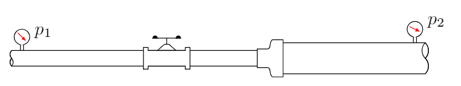

$$
\require{cancel}
\newcommand{\s}{\mathrm{s}}
\newcommand{\min}{\mathrm{min}}
\newcommand{\hr}{\mathrm{hr}}
\newcommand{\kg}{\mathrm{kg}}
\newcommand{\kN}{\mathrm{kN}}
\newcommand{\inch}{\mathrm{in}}
\newcommand{\ft}{\mathrm{ft}}
\newcommand{\m}{\mathrm{m}}
\newcommand{\mm}{\mathrm{mm}}
\newcommand{\km}{\mathrm{km}}
\newcommand{\mi}{\mathrm{mi}}
\newcommand{\cm}{\mathrm{cm}}
\newcommand{\lb}{\mathrm{lb}}
\newcommand{\lbm}{\mathrm{lbm}}
\newcommand{\lbf}{\mathrm{lbf}}
\newcommand{\N}{\mathrm{N}}
\newcommand{\slug}{\mathrm{slug}}
\newcommand{\Pa}{\mathrm{Pa}}
\newcommand{\kPa}{\mathrm{kPa}}
\newcommand{\mph}{\mathrm{mph}}
\renewcommand{\psi}{\mathrm{psi}}
\newcommand{\C}{^\circ\mathrm{C}}
\newcommand{\F}{^\circ\mathrm{F}}
\newcommand{\Re}{\mathrm{Re}}
\newcommand{\WP}{\mathrm{WP}}
\newcommand{\L}{\mathrm{L}}
\newcommand{\gpm}{\mathrm{gpm}}
$$

# Energy loss due to friction
{:.no_toc}

* A markdown unordered list for the toc
{:toc}

# Energy loss in pipes due to friction

When a fluid travels in a pipe energy is dissipated by friction.  The amount of energy lost depends on a number of factors such as the fluid's speed and viscosity.  If the flow is turbulent it can even depend on the roughness of the pipe walls.

Losses due to friction will cause the pressure to decrease along the length of the pipe, therefore increasing the amount of power that a pump must deliver to maintain the flow.  These losses can become significant in systems where long stretches of piping are employed (for example, in heat exchangers, oil pipelines, fire protection systems, etc.).
  

We start off this section with the general the energy equation:

$$
\frac{p_1}{\gamma}+z_1+\frac{v_1^2}{2g}+h_A-h_R-h_L=\frac{p_2}{\gamma}+z_2+\frac{v_2^2}{2g}
\,,
$$

The quantity $h_L$ represents the energy loss in the system and in this section we will learn how to compute it.  We will first examine the energy loss from friction as fluid flows through a round pipe.  Next we will generalize this to pipes or tubes of noncircular cross sections.  Finally we will look energy losses due to valves and fittings (called *minor losses*).

We use *Darcy's equation*
 to calculate the loss due to friction in pipes,

$$
h_L=f\times \frac{L}{D}\times \frac{v^2}{2g}
\,.
$$

In the above expression $L$ is the length of pipe, $D$ its diameter, and $v$ the average velocity of flow.  The dimensionless quantity $f$ is called the *friction factor*.  The method of obtaining $f$ will depend on whether the flow is laminar or turbulent.
  We all have an intuitive notion of what we mean by laminar and turbulent flow.  Laminar flow has the appearance of a smooth and steady stream while turbulent flow appears chaotic and irregular and may contain eddies and swirls of fluid.
  But how can we predict the flow's behavior, in particular if the flow is occurring in an opaque pipe where observations can't be made.

  
  <!-- https://pixabay.com/en/rapids-water-turbulence-flowing-355737/ -->
  

  Laminar and turbulent water flow.
  


In a <a href="http://rstl.royalsocietypublishing.org/content/174/935">1883 paper</a> Osborne Reynolds showed that a single dimensionless number, now called the *Reynolds number* ($\Re$), determines whether the flow is laminar or turbulent.  The Reynolds number for round pipes is
$$
\Re=\frac{v D\rho}{\eta}=\frac{vD}{\nu}
$$

The two definitions above are identical and simply result from the relation between dynamic and kinematic viscosity, $\nu=\eta/\rho$.  The quantities entering into the definition of the Reynolds number are summarized in the following table.

<table class="table table-striped">
<caption>
Quantities that enter into the determination of the Reynolds number for round pipes.
</caption>
<thead>
<tr><th> Quantity </th><th> Symbol    </th><th>  SI units  </th><th>  US units</th></tr>
</thead>
<tbody>
<tr><td>Velocity            </td><td> $v$    </td><td> m/s           </td><td>  ft/s             </td></tr>
<tr><td>Diameter            </td><td> $D$    </td><td> $D$           </td><td>  ft               </td></tr>
<tr><td>Density             </td><td> $\rho$ </td><td> kg/m$^3$      </td><td>  slugs/ft$^3$     </td></tr>
<tr><td>Dynamic Viscosity   </td><td> $\eta$ </td><td> kg/m$\cdot$s  </td><td>  slugs/ft$\cdot$s </td></tr>
<tr><td>Kinematic Viscosity </td><td> $\nu$  </td><td> m$^2$/s       </td><td>  ft$^2$/s         </td></tr>
</tbody>
</table>

For practical purposes, if $\Re < 2000$ the flow is laminar and if $\Re>4000$ the flow is turbulent.  For a Reynolds number between 2000 and 4000 it is difficult if not impossible to resolve the nature of the flow.  The design of most systems should avoid flows in this *transition region* due to their unpredictable behavior.


Glycerin at $25\C$ is pumped through a DN 125 schedule 80 steel pipe at an average velocity of $v=5~\m/\s$.  Is the flow laminar or turbulent?



To determine the nature of the flow we compute the Reynold's number.
$$
\Re=\frac{v D\rho}{\eta}
$$

From the <a href="https://kdusling.github.io/teaching/Applied-Fluids/PropertiesOfCommonLiquids.html">Properties of common liquids table
</a> we find that for glycerin at $25\C$:
$$
\rho=1263~\kg/\m^3\,,\quad
\eta=9.50\times 10^{-1}~\Pa\cdot\s
$$
From the <a href="https://kdusling.github.io/teaching/Applied-Fluids/SteelPipeTable.html?sch=80&mat=comSteel">Schedule 80 Steel Pipe Data Table
</a> we find that for DN 125 schedule 80 pipe $D=122.3~\mm$.  We now have everything we need to find the Reynolds number
$$
\Re=\frac{v D\rho}{\eta}=\frac{\left(5~\m/\s\right)\left(0.1223~\m\right)\left(1263~\kg/\m^3\right)}{9.50\times 10^{-1}~\Pa\cdot\s}=813
$$

Notice that all the units cancel resulting in a dimensionless quantity.  Since $\Re=813$ is less than $2000$ the flow is laminar.



The first step in an energy loss calculation is to determine whether the flow is laminar or turbulent by computing the Reynolds number.  The next step is to compute the friction factor, $f$, that appears in Darcy's equation for the energy loss $h_L$.  The procedure to compute the friction factor is different for laminar and turbulent flow.  The procedure for laminar flow is more straightforward and will be discussed next.  We will then discuss the procedure for turbulent flows.  

## Friction losses in laminar flows

If after computing the Reynolds number we find that the flow is laminar (*i.e.* the Reynolds number is less than 2000) the friction factor is given by the formula,

$$
f=\frac{64}{\Re}
\quad\quad\rm{(Laminar~flow~circular~duct)}
$$

The above expression can be derived from first principles but that goes beyond the scope of these notes.
 Here is an example.


Glycerin at $25\C$ is pumped through $100~\m$ of DN 125 schedule 80 steel pipe at an average velocity of $v=5~\m/\s$.  Determine the energy loss.




From the previous example we found $\Re=813$ and therefore predict laminar flow.  The energy loss is determined from Darcy's equation

$$
h_L=f\times \frac{L}{D}\times \frac{v^2}{2g}
$$

Since the flow is laminar we use

$$
f=\frac{64}{\Re}=\frac{64}{813}=0.0787
$$

Now that we have the friction factor we compute the energy loss,

$$
h_L=0.0787\times \frac{100~\m}{0.1223~\m}\times \frac{\left(5~\m/\s\right)^2}{2(9.81~\m/s^2)}=82~\m
$$

Remember that the quantity $h_L$ is the energy loss per unit weight.  We can write it as $h_L=82~\N\cdot \m/\N=82~{\rm J}/\N$.  In practice this means that for every newton of glycerin that flows through this system 82 joules of energy is dissipated.



You should be aware of another commonly used expression for the friction loss in laminar pipe flows, the Hagen-Poiseuille equation,

$$
h_L=\frac{32\eta L v}{\gamma D^2}\,.
$$

This can be obtained by substituting $f=64/\Re$ into Darcy's equation along with the Reynolds number for circular sections, $\Re=v D\rho/\eta$.  It is therefore identical to the procedure of using $f=64/\Re$ in Darcy's equation.  However, the Hagen-Poiseuille equation is valid only for laminar flows.  Darcy's equation is appropriate for laminar or turbulent flows as long as the proper friction factor is used.  In practice I never use the Hagen-Poiseuille equation.

## Friction losses in turbulent flows

For turbulent flows we again use Darcy's equation, however in this case there is no longer a nice expression for the friction factor. The friction factor, $f$, must be found empirically (*i.e.* from experiment).  It turns out that the friction factor depends on two dimensionless numbers; the Reynolds number and the *relative roughness* ($\epsilon/D$) of the pipe.  

The relative roughness is the ratio of $\epsilon$, a characteristic scale representing the roughness of the pipe's inside surface, divided by its inner diameter, $D$.  Approximate values of pipe roughness for various materials are listed in the following table.

<table class="table table-striped">
<caption>
  Roughness for various pipe materials. 
</caption>
<thead>
<tr><th>Pipe Material </th><th> $\epsilon$ [inches]</th><th>  $\epsilon$ [mm]</th></tr>
</thead>
<tbody>
  <tr><td>Commercial or Welded Steel</td><td> 0.0018 </td><td>  0.046</td></tr>
  <tr><td>PVC, Glass, Other Drawn Tubing</td><td>0.00006</td><td>0.0015 </td></tr>
  <tr><td>Cast iron </td><td>  0.01 </td><td>  0.26</td></tr>
  <tr><td>Galvanized iron </td><td> 0.006  </td><td> 0.15 </td></tr>
  <tr><td>Smooth concrete </td><td>  0.012 </td><td> 0.3 </td></tr>
  <tr><td>Rough concrete </td><td>  0.12 </td><td> 3.0 </td></tr>
</tbody>

</table>

 The *Moody diagram* is a graphical representation of thousands of pipe flow experiments showing how the friction factor, $f$, depends on the Reynolds number, $\Re$, and the relative roughness, $\epsilon/D$, of the pipe.

  
  

  Moody diagram showing the friction factor vs Reynolds number. <a href="img/Moody.pdf">Download</a> a pdf version for printing.
  

There is a lot going on in this plot.  I recommend making a full page printout using <a href="img/Moody.pdf">this pdf</a>.  Let's walk through all the features in succession.  First, note that this is a double-log plot (*i.e.* both the x and y axis are in log scale).  For a Reynolds number less than 2000 we know the flow is laminar.  The friction factor in this case is $f=64/\Re$ and plotted as a straight line labelled "Laminar" (remember, $y=1/x$ appears as a straight line when plotted on a log plot).

The "Transition Region" occurs between a Reynolds number of about 2000 to about 4000 and represented by the shaded region.  Even though we extend the curves into this region, reliable results for the friction factor are unavailable.  Avoid working in this region if possible.

Above a Reynolds number of 4000 the flow is turbulent.  The friction factor depends not only on the Reynolds number but also on the relative roughness ($\epsilon/D$) of the pipe.  Each blue curve shows how the friction factor varies with Reynolds number for a fixed value of relative roughness.  The bottom most blue curve is the "smooth pipe" limit if the roughness is small enough to be considered negligible.   

At a large enough Reynolds number each blue curve becomes flat (*i.e.* no longer depends on the Reynolds number).  This flow regime is called the *Zone of complete turbulence* and is located to the right of the dotted curve.  In the zone of complete turbulent the Reynolds number has no effect on the friction factor.  It does, however, still depend on the pipe roughness.

Turpentine at $25\C$ is pumped through $100~\m$ of DN 125 schedule 80 steel pipe at an average velocity of $v=5~\m/\s$.  Determine the energy loss.




The starting point is the same as before but we now must reevaluate the Reynolds number since the properties of turpentine differ from that of glycerin.

From <a href="https://kdusling.github.io/teaching/Applied-Fluids/PropertiesOfCommonLiquids.html">this table</a> turpentine at $25\C$ has the following properties:

$$
\rho=870~\kg/\m^3\,,\quad
\eta=1.375\times 10^{-3}~\Pa\cdot\s
$$

The density of turpentine is lower by about 30&#37;, but the dynamic viscosity decreases by a factor of 700! Let's see how this affects the Reynolds number.

$$
\Re=\frac{v D\rho}{\eta}=\frac{\left(5~\m/\s\right)\left(0.1223~\m\right)\left(870~\kg/\m^3\right)}{1.375\times 10^{-3}~\Pa\cdot\s}=3.87\times 10^5
$$

The Reynolds number is well above 4000 so we predict turbulent flow.
The energy loss is still determined from Darcy's equation
 but the friction factor must be found from Moody's diagram.  In order to accomplish this we first estimate the relative roughness of the pipe.  For commercial steel the roughness is 0.046 mm.  Earlier on we found the inside diameter of the pipe to be $D=122.3~\mm$.  The dimensionless relative roughness is therefore,

$$
\epsilon/D=\frac{0.046~\mm}{122.3~\mm}=0.00038\,.
$$

Looking at the Moody diagram we find no curve for this specific value of $\epsilon/D$.  We're going to have to approximate and use the nearby curve for $\epsilon/D=0.0005$ instead.

Here is how to find the friction factor from the Moody diagram.  First,  identify the curve corresponding to $\epsilon/D=0.0005$.  I've highlighted it in order to not be distracted by the other curves.  Locate the Reynolds number of $\Re=4\times 10^5$ (yes, I rounded up) on the x-axis (remember, log scale) and draw a vertical line up.  The intersection with the highlighted curve represents the value of the friction factor at this Reynolds number.  Following the horizontal line to the y-axis we read off a friction factor of $f=0.018$ (again, log scale).

  
  

  For a Reynolds number of $\Re=4\times 10^5$ and relative roughness $\epsilon/D=0.005$ a friction factor of $f=0.018$ is found.
  

Now that we have the friction factor we compute the energy loss using Darcy's equation

$$
h_L=0.018\times \frac{100~\m}{0.1223~\m}\times \frac{\left(5~\m/\s\right)^2}{2(9.81~\m/s^2)}=18.8~\m
$$

The energy loss is about four times smaller than the previous example of glycerin where the flow was laminar at the same velocity.  Less energy is dissipated because the viscosity of turpentine is lower.  

Alternatively an <a href="https://kdusling.github.io/teaching/Applied-Fluids/FrictionFactor.html">online Darcy friction factor calculator</a> could be used.  Entering the Reynolds number and roughness from above results in a friction factor $f=0.017$, close to the value of $f=0.018$ found from the Moody diagram.





# Hydraulic Diameter

It turns out that the methods used for the calculation of friction losses in circular pipes can be extended in a straightforward fashion to non-circular tubes.  In order to do this we introduce a new variable called the *hydraulic diameter* ($D_H$) representing the characteristic dimension of the noncircular cross section.  The hydraulic diameter is defined as

$$
D_H=\frac{4A}{\WP}=\frac{4\times\rm{Area}}{\rm{Wetted~Perimeter}}

$$

The wetted perimeter, $\WP$, is the length of the boundary that is in contact with (wetted by) the fluid.  The Area, $A$, represents the cross sectional area of the flow.  Once the hydraulic diameter is calculated all the techniques from the previous section can be used by simply replacing the diameter, $D$, by the hydraulic diameter, $D_H$.  For noncircular cross-sections we therefore make the following three replacements.

$$
1.~~\Re=\frac{v D_H \rho}{\eta} \qquad\qquad
2.~~h_L=f\frac{L}{D_H}\frac{v^2}{2g} \qquad\qquad
3.~~\epsilon/D \longrightarrow \epsilon/D_H
$$

A shell and tube heat exchanger is a common design of heat exchanger comprising of an outside shell (pressure vessel) and a bundle of tubes inside it. One fluid runs through the tubes and another fluid flows over the tubes (through the shell) in order to exchange heat between the two fluids.

The figure below shows a very simple shell and tube heat exchanger consisting of one circular tube that runs horizontally through the middle of a rectangular shell.  The inside tube carries $50~\L/\min$ of oil at $200\F$.  The shell carries $4500~\L/\min$ of sea water at $25\C$ to carry heat away from the oil.  If the length of the shell is $1.8~\m$ estimate the energy loss and pressure drop of the sea water.  Assume that the surface roughness is the same as drawn brass or copper tubing ($\epsilon=0.0015~\mm$).

Note that even though the flow rate and temperature of the oil is provided it is irrelevant to the problem at hand.  We are focusing on the energy dissipated by the sea water flowing through the outer shell of the heat exchanger.  

The first step is to determine whether the flow is laminar or turbulent.  In order to do this we must compute the Reynolds number but that requires the hydraulic diameter.  Here is how to compute the hydraulic diameter for the shell the sea water is flowing in. The hydraulic diameter is defined as,

$$
D_H=\frac{4A}{\WP}\,.
$$

The area $A$ is the cross-sectional area where the sea water flows.  Looking at the cross section of the heat exchanger the net flow area is the difference between the area inside the square shell and the outside the tube:

$$
A = (250~\mm)^2 - \pi\frac{(150~\mm)^2}{4}=44,800~\mm^2\,.
$$

The wetted perimeter $WP$ is the length of surface touched by the fluid.  The sea water touches the walls of the rectangular shell and the outside surface of the tube.  The total perimeter *wetted* by the fluid is therefore the sum of these two surfaces:

$$
\WP = 4\times(250~\mm) + \pi(150~\mm)=1470~\mm\,.
$$

The hydraulic diameter is therefore

$$
D_H=\frac{4A}{\WP}=\frac{4\times 44,800~\mm^2}{1470~\mm}=122~\mm\,.
$$

To compute the Reynolds number ($\Re=v D_H \rho/\eta$) we will need the density and viscosity of sea water which I take from <a href="https://kdusling.github.io/teaching/Applied-Fluids/PropertiesOfCommonLiquids.html">this table</a>:

$$
\rho=1030~\kg/\m^3\,,\quad
\eta=1.03\times 10^{-4}~\Pa\cdot\s\,.
$$

The last quantity we need is the velocity of the sea water.  This we can calculated from the continuity equation since we were given the volume flow rate of $4500~\L/\min$.  First we convert the area and flow rate into the standard SI units:

$$
A=44,800~\cancel{\mm^2}\times\left(\frac{1~\m}{1000~\cancel{\mm}}\right)^2=0.0448~\m^2 \\
Q=4500~\cancel{\L/\min}\times\left( \frac{1~\m^3/s}{60,000~\cancel{\L/\min}} \right)=7.5\times 10^{-2}~\m^3/s\,.
$$

The continuity equation $Q=vA$ can be rearranged to solve for the average flow velocity, $v=Q/A$,

$$
v=\frac{Q}{A}=\frac{7.5\times 10^{-3}~\m^3/s}{0.0448~\m^2}=1.67~\m/s\,.
$$

The Reynolds number is then

$$
\Re=\frac{v D_H \rho}{\eta} = \frac{1.67~\m/s\times 0.122~\m \times 1030~\kg/\m^3}{1.03\times 10^{-4}~\Pa\cdot\s}=2\,037\,400
$$

Since the Reynolds number is greater than 4000 the flow is turbulent. We will therefore need to use the Moody diagram to find the friction factor.  The relative roughness is

$$
  \epsilon/D_H=\frac{0.0015~\mm}{122~\mm}=0.000012
$$

Our version of the Moody diagram has a curve for $\epsilon/D=0.00001$ which is close enough for our purposes.  At a $\Re=2\times 10^6$ the friction factor is $f\approx 0.011$.  Now that we have the friction factor the energy loss is computed with Darcy's equation:

$$
h_L=f\frac{L}{D_H}\frac{v^2}{2g}=0.011\times \frac{1.8~\m}{0.122~\m}\times \frac{\left(1.67~\m/s\right)^2}{2(9.81~\m/s^2)}=0.023~\m
$$

Assuming the heat exchanger is horizontal the pressure drop across the shell is

$$
\Delta p=\gamma h_L=10.10~\frac{\kN}{\m^3}\times 0.023~\m = 0.233~\kPa = 233~\Pa\,.
$$

# Minor Losses

Energy losses through valves, bends, expansions, contractions, gauges,
 flow meters, etc, are generally referred to as *minor losses*. Note that
 the cumulative effect of a number of *minor losses* can be substantial.
  Energy losses are proportional to the velocity head near the component of interest. The energy loss can be expressed as

$$ h_L=K\left(\frac{v^2}{2g}\right) $$

where $K$ is a resistance coefficient and $v$ is the average
 flow velocity in the component.   For expansions and contractions
 I use the convention that  the velocity is taken in the smaller section of pipe.

## Sudden Enlargement

As fluid flows through an enlargement the decrease in velocity (think
 continuity eqn) is accompanied by an increase in pressure (think
 Bernoulli\'s eqn). If the enlargement is sharp or sudden regions of
 turbulence develop in the corners of the larger pipe. The regions of
 turbulence result in the dissipation of kinetic energy into internal
 energy. The energy loss (expressed as a loss of head) is written as

$$
 h_L=K\left(\frac{v_1^2}{2g}\right) $$

where $v_1$ is the
 velocity in the *smaller* section of pipe.

  
  

  Cartoon of flow through an abrupt enlargement.
  


Under some [simplifying assumptions the resistive coefficient can be derived](http://www.nptel.ac.in/courses/112104118/lecture-14/14-6_losses_sudden_enlarg.htm):

$$ K\approx \left[1-\frac{A_1}{A_2}\right]^2 $$

The above
 expression works fairly well for moderate velocities and is a reasonable
 starting point for estimating losses due to a sudden expansion. If the
 sudden transition between pipe sizes can be made more gradual the energy
 loss can be reduced. A *diffuser* is a device that converts kinetic energy to pressure
 energy by a gradual enlargement in pipe size. It turns out that a gradual enlargement having a cone angle of about $7^\circ$ minimizes the energy loss.

### Exit Loss

When a fluid flows from a pipe into a large tank or reservoir all of the
 kinetic energy is dissipated (the kinetic energy in the static tank is
 zero). This can be treated as a limiting case of sudden expansion by
 taking $A_1\to 0$ in our expression for the resistive coefficient.
 This results in $K\to 1$ and a head loss of

$$
 h_L=1.0\left(\frac{v_1^2}{2g}\right) $$

  
  

  *Exit loss* results from a fluid flowing into a static reservoir.
  


## Sudden Contraction


A sudden contraction in a pipe results in a drop in pressure due to the
 sudden increase in velocity and the loss of energy due to turbulence.
 The energy loss (expressed as a loss of head) is written as,

$$
h_L=K\left(\frac{v_2^2}{2g}\right)\,, $$

where $v_2$ is the
 velocity in the *smaller* section of pipe downstream of the contraction.

The mechanism of energy loss in a contraction is much more complex than
 that of an expansion. The cartoon below shows the path of the flow
 stream. Regions of turbulence develop both before the contraction and
 after the contraction. The region where the cross-section is minimum is
 known as the *vena contracta*.

A number of empirical equations for the resistance coefficient for sudden contraction can be found in the literature. One of the [simplest
 I found](http://amzn.to/2hla1qx) is a good starting point for estimating losses in sudden contractions:

$$ K\approx
 0.5\left[1-\frac{A_2}{A_1}\right]\,. $$

More
 accurate resistive coefficients should be taken from other resources
 such as [CRANE Technical Paper 410](http://store.flowoffluids.com/TP410-US.html).


  
  

  Cartoon of flow through a sudden contraction.
  

### Entrance Loss

The losses that occur when a fluid flows from a larger reservoir or tank
 into a pipe are called *entrance losses*. For a square-edged inlet as
 shown in the cartoon below the resistive coefficient is
 $K\approx0.5$. This is the limiting case of $A_1\to \infty$ in
 the equation for $K$ above. Chamfered and rounded inlets have smaller
 resistance coefficients. For a chamfered inlet $K\approx 0.25$ and
 for a well-rounded inlet $K\approx 0.04$.

  
  

  *Entrance loss* results from a fluid flowing from a large tank or reservoir into a pipe.
  


## Valves and Fittings


For valves and fittings we use the same formula,

$$
h_L=K\left(\frac{v^2}{2g}\right)\,
$$

where the resistance coefficient is typically expressed as

$$
K=\left(L_e/D\right)f_T \,.
$$

The factor
 $\left(L_e/D\right)$ is known as the *equivalent length ratio* and is
 taken as a constant for a given type of valve or
 fitting.  The [table below](#LeOverD) provides equivalent length ratios for some common styles of valves and fittings. $f_T$ is the friction factor in the zone of complete turbulence.  Remember, in the zone of complete turbulence the friction factor is independent of Reynolds number and is a function of relative roughness.  We use the relative roughness of the pipe connected to our fitting. The tables for
 [Schedule 40](../SteelPipeTable.html?sch=40&mat=comSteel) and [Schedule 80](../SteelPipeTable.html?sch=40&mat=comSteel) list the values of $f_T$ for commercial steel pipes.

<table class="table table-striped">
<caption>
<a name="LeOverD">
Equivalent length ratios for valves and fittings.  Based on
$h_L=f_T \frac{L_e}{D} \frac{v^2}{2g}$.
</caption>
<thead>
<tr><th> Fitting Type  </th><th> Equivalent Length, $L_e/D$ </th></tr>
</thead>
<tbody>
<tr><td>Gate valve (fully open)                                 </td><td style="padding-left: 50px;"> 8     </td></tr>
<tr><td>Globe valve (fully open)                                </td><td style="padding-left: 50px;"> 340   </td></tr>
<tr><td>Angle valve (fully open)                                </td><td style="padding-left: 50px;"> 150   </td></tr>
<tr><td>Butterfly valve (fully open):                           </td><td>&nbsp;                         </td></tr>
<tr><td style="padding-left: 50px;">50 mm (2") - 200 mm (8")    </td><td style="padding-left: 50px;"> 45    </td></tr>
<tr><td style="padding-left: 50px;">250 mm (10") - 350 mm (14") </td><td style="padding-left: 50px;"> 35    </td></tr>
<tr><td style="padding-left: 50px;">400 mm (16")- 600 mm (24")  </td><td style="padding-left: 50px;"> 25    </td></tr>
<tr><td>90° standard elbow                                      </td><td style="padding-left: 50px;"> 30    </td></tr>
<tr><td>45° standard elbow                                      </td><td style="padding-left: 50px;"> 16    </td></tr>
<tr><td>Close pattern return bend                               </td><td style="padding-left: 50px;"> 50    </td></tr>
</tbody>
</table>

The value of $L_e$ is called the equivalent length of pipe; it is the
 length of straight pipe that would produce the same loss as the valve.
  For example a 2" fully open globe valve $(L_e/D=340)$ has $L_e
 \approx 57~\ft$. This value of $L_e$ can than be added to the
 actual length of pipe to determine the total losses. While convenient,
 this procedure is only accurate when the actual pipe flows are in the
 zone of complete turbulence.

  
  
  
  

  Left: Wafer type centerline butterfly valve. Middle: Knife gate valve.  Right: A DIN globe valve. Images from [Metals Valve](http://www.metalsvalve.com).
  

A 2-in schedule 40 steel pipe that is 100 ft long is attached to 60 ft of 3-in schedule 40 steel pipe.  The 2-in pipe contains a gate valve.  If 75 gpm of hexane flows from left to right determine the pressure drop $p_1-p_2$.  

This problem requires that we put together everything we learned thus far.  We start off with the generalized energy equation:

$$
\frac{p_1}{\gamma}+z_1+\frac{v_1^2}{2g}+h_A-h_R-h_L=\frac{p_2}{\gamma}+z_2+\frac{v_2^2}{2g}
$$

Since the pipe is horizontal we can ignore the elevation terms.  There are no devices (pumps or motors) so we can also ignore those two contributions.  We are therefore left with:

$$
\frac{p_1}{\gamma}+\frac{v_1^2}{2g}-h_L=\frac{p_2}{\gamma}+\frac{v_2^2}{2g}
$$

With some algebra we can rearrange and solve for the quantity of interest, the pressure drop:

$$
p_1-p_2=\gamma \frac{v_2^2-v_1^2}{2g}+\gamma h_L  
$$

The first contribution represents Bernoulli's principle; a decrease in the speed of a fluid occurs simultaneously with an increase in pressure.  The continuity equation tells us that $v_2$ will be less than $v_1$.  Therefore the quantity $\left(v_2^2-v_1^2\right)$ will be negative and if there were no losses ($h_L=0$) the quantity $p_1-p_2$ would be negative (*i.e.* $p_2$ would be greater than $p_1$).  In other words, if losses were negligible Bernoulli's equation tells us there would actually be a pressure rise.  This is a consequence of conservation of energy; the kinetic energy decreases from pipe 1 to pipe 2 so the pressure energy must increase accordingly.

Let us now actually calculate this.  First, we need the velocity in each pipe.  This can be found from the continuity equation $Q=vA$ where $A$ is the flow area taken from <a href="https://kdusling.github.io/teaching/Applied-Fluids/SteelPipeTable.html?sch=40&mat=comSteel">this table</a>.  The volume flow rate, Q, is

$$
Q=75~\cancel{\gpm} \times \left( \frac{1~\ft^3/s}{449~\cancel{\gpm}}\right)=0.167~\ft^3/s
$$

and the velocities in the 2-in pipe (labeled $v_1$) and 3-in pipe (labeled $v_2$) are,

$$
v_1=\frac{Q}{A_{\text{2-in}}}=\frac{0.167~\ft^3/s}{0.02330~\ft^2}=7.167~\ft/s \\
v_2=\frac{Q}{A_{\text{3-in}}}=\frac{0.167~\ft^3/s}{0.05134~\ft^2}=3.253~\ft/s
$$

The change in velocity head is therefore

$$
\frac{v_2^2-v_1^2}{2g}=\frac{ (3.253~\ft/s)^2 - (7.167~\ft/s)^2}{2\times 32.2~\ft/s^2}=-0.633~\ft
$$

From <a href="https://kdusling.github.io/teaching/Applied-Fluids/PropertiesOfCommonLiquids.html">this table</a> we the density of hexane is $\rho=41.00~\lb/\ft^3$ and we find that,

$$
\left( p_1-p_2 \right)_ {\rm{ideal}} = \gamma \frac{v_2^2-v_1^2}{2g}=41 ~\lb/\ft^3\left(-0.633~\ft\right)=-25.953~\frac{\lb}{\cancel{\ft^2}}\times \left(\frac{1~\cancel{\ft}}{12~\inch}\right)^2=-0.180~\psi
$$

I put the label *ideal* on the pressure drop (actually a rise) in order to remind us that this would be the change in pressure without losses.   In this problem we must consider four different sources of losses (the labels should be self-explanatory):

$$
h_L(\text{total})= h_L(\text{2-in pipe}) + h_L(\text{3-in pipe}) + h_L(\text{expansion}) + h_L(\text{gate valve})
$$

First we calculate the friction losses in the 2-in and 3-in pipes.  Since the procedure is identical for the two pipes we will do these calculations simultaneously.  The first step is to compute the Reynolds number for each pipe:

$$
\Re_{\text{2-in}}=\frac{\rho v_1 D_{\text{2-in}}}{\eta}=\frac{(1.27)(7.167)(0.1723)}{6.20\times 10^{-6}}=2.53\times 10^5\\
\Re_{\text{3-in}}=\frac{\rho v_2 D_{\text{3-in}}}{\eta}=\frac{(1.27)(3.253)(0.2557)}{6.20\times 10^{-6}}=1.70\times 10^5
$$

In both pipes the Reynolds number is larger than 4000 so the flow is turbulent.  We therefore need the relative roughness of each pipe.  Given an absolute roughness of $\epsilon=0.0018$ inches for commercial steel we find

$$
\left(\epsilon/D\right)_ {\text{2-in}}=0.000871 \\
\left(\epsilon/D\right)_ {\text{3-in}}=0.000587
$$

With the Reynolds number and relative roughness we can find the friction factors from the Moody diagram.  From <a href="https://kdusling.github.io/teaching/Applied-Fluids/FrictionFactor.html"> this online tool</a> I find:

$$
f_{\text{2-in}}= 0.0202 \\
f_{\text{3-in}}= 0.0195
$$

Now that we have the friction factors it is straightforward to find the head loss in each pipe:

$$
h_L(\text{2-in pipe})=f_{\text{2-in}} \times \frac{L_{\text{2-in}}}{D_{\text{2-in}}} \times \frac{v_1^2}{2g}=(0.0202)\frac{100}{0.1723}\frac{(7.167)^2}{2\times 32.2}=9.35~\ft\\
h_L(\text{3-in pipe})=f_{\text{3-in}} \times \frac{L_{\text{3-in}}}{D_{\text{3-in}}} \times \frac{v_2^2}{2g}=(0.0195)\frac{60}{0.2557}\frac{(3.253)^2}{2\times 32.2}=0.75~\ft
$$

Next we compute the losses at the expansion fitting.  We assume a sudden expansion

$$
h_L(\text{expansion})=K\frac{v_1^2}{2g}
$$

where $v_1$ has been correctly chosen to be the velocity of the entrance flow (the smaller pipe).  The resistance coefficient, $K$, is estimated from,

$$
K= \left[1-\frac{A_1}{A_2}\right]^2 = \left[1-\frac{0.02330}{0.05134}\right]^2=0.298
$$

Putting in the numbers we find,

$$
h_L(\text{expansion})=K\frac{v_1^2}{2g}=(0.298)\frac{(7.167)^2}{2\times 32.2}=0.238~\ft\,.
$$

The last loss we compute is that in the gate valve.
The loss is expressed as,

$$
h_L(\text{gate valve})=K\left(\frac{v_1^2}{2g}\right)
$$

where $v_1$ is the velocity at the valve. The resistance coefficient, $K$, is the equivalent length ratio times the friction factor in the zone of complete turbulence.  The equivalent length ratio for a fully open gate vale is 8.  The friction factor in the zone of complete turbulence for a 2-in schedule 40 pipe is $f_T=0.019$.  The resistance coefficient is therefore:

$$
K=\left(L_e/D\right)f_T = 8\times (0.019)=0.128\,.
$$

The energy loss at the gate valve is:

$$
h_L(\text{gate valve})=K\frac{v_1^2}{2g}=(0.128)\frac{(7.167)^2}{2\times 32.2}=0.102~\ft\,.
$$

We now return to our original expression for the pressure drop:

$$
p_1-p_2=\gamma \frac{v_2^2-v_1^2}{2g}+\gamma \left[h_L(\text{2-in pipe}) + h_L(\text{3-in pipe}) + h_L(\text{expansion}) + h_L(\text{gate valve})\right]
$$

We already found the pressure drop (actually rise) from the first term to be -0.180 psi.  Adding in the pressure drops due to the four sources of frictional losses results in

$$
p_1-p_2= -0.180~\psi + 41~\lb/\ft^3\left[9.35~\ft+0.75~\ft+0.238~\ft+0.102~\ft\right]\times \left(\frac{1~\ft}{12~\inch}\right)^2 \\
p_1-p_2= -0.180~\psi + \left[2.662~\psi + 0.214~\psi+0.068~\psi+0.029~\psi\right]
$$

You could just compute the answer in one shot.  I think it is good practice to write it like I did above in order to see the magnitude of each loss.  In this problem, the biggest loss occurs from the pressure drop in the 2-in pipe. The final answer is

$$
p_1-p_2=-0.180~\psi+2.973~\psi=2.793~\psi
$$

Depending on the magnitude of the losses the pressure $p_2$ might end being larger or small than $p_1$.  If the energy dissipated is larger than the reduction in kinetic energy the pressure will end up decreasing  ($p_1$ will end up being larger than $p_2$ and the quantity $p_1-p_2$ will be positive).  The only way to see if this is the case is to compute $h_L$.

