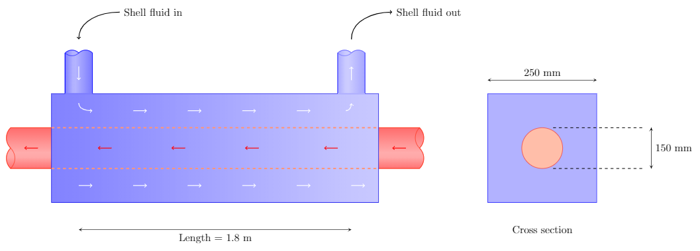

$$
\require{cancel}
\newcommand{\s}{\mathrm{s}}
\newcommand{\min}{\mathrm{min}}
\newcommand{\hr}{\mathrm{hr}}
\newcommand{\kg}{\mathrm{kg}}
\newcommand{\kN}{\mathrm{kN}}
\newcommand{\inch}{\mathrm{in}}
\newcommand{\ft}{\mathrm{ft}}
\newcommand{\m}{\mathrm{m}}
\newcommand{\mm}{\mathrm{mm}}
\newcommand{\km}{\mathrm{km}}
\newcommand{\mi}{\mathrm{mi}}
\newcommand{\cm}{\mathrm{cm}}
\newcommand{\lb}{\mathrm{lb}}
\newcommand{\lbm}{\mathrm{lbm}}
\newcommand{\lbf}{\mathrm{lbf}}
\newcommand{\N}{\mathrm{N}}
\newcommand{\slug}{\mathrm{slug}}
\newcommand{\Pa}{\mathrm{Pa}}
\newcommand{\kPa}{\mathrm{kPa}}
\newcommand{\mph}{\mathrm{mph}}
\renewcommand{\psi}{\mathrm{psi}}
\newcommand{\C}{^\circ\mathrm{C}}
\newcommand{\F}{^\circ\mathrm{F}}
\newcommand{\Re}{\mathrm{Re}}
\newcommand{\WP}{\mathrm{WP}}
\newcommand{\L}{\mathrm{L}}
$$

# Energy loss due to friction
{:.no_toc}

* A markdown unordered list for the toc
{:toc}

# Energy loss in pipes due to friction

As a fluid flows through a pipe energy will be dissipated due to friction.  The amount of energy dissipated will depend on a number of factors such as the fluid's speed and viscosity.  If the flow is turbulent it can even depend on the material the pipe is made from.

Losses due to friction will cause the pressure to decrease along the length of the pipe, therefore increasing the amount of power that a pump must deliver to maintain the flow.  These losses can become significant in systems where long stretches of piping are employed (for example, in heat exchangers, oil pipelines, fire protection systems, etc.).
  

We start off this section with the general the energy equation:

$$
\frac{p_1}{\gamma}+z_1+\frac{v_1^2}{2g}+h_A-h_R-h_L=\frac{p_2}{\gamma}+z_2+\frac{v_2^2}{2g}
\,,
$$

The quantity $h_L$ represents the energy loss in the system.  In this section we will learn how to compute $h_L$.  We will first examine the energy loss from friction as fluid flows through a pipe.  Then we will look at the energy loss occurring when fluid travels through valves and fittings.

The energy loss from friction in pipes and tubes is determined from *Darcy's equation*
,

$$
h_L=f\times \frac{L}{D}\times \frac{v^2}{2g}
\,.
$$

In the above expression $L$ is the length of pipe, $D$ its diameter, and $v$ the average velocity of flow.  The dimensionless quantity $f$ is called the *friction factor*.  The method of obtaining $f$ will depend on whether the flow is laminar or turbulent.
  We all have an intuitive notion of what we mean by laminar and turbulent flow.  Laminar flow has the appearance of a smooth and steady stream while turbulent flow appears chaotic and irregular and may contain eddies and swirls of fluid.
  But how can we predict the flow's behavior, in particular if the flow is occurring in an opaque pipe where observations can't be made.

  
  <!-- https://pixabay.com/en/rapids-water-turbulence-flowing-355737/ -->
  

  Laminar and turbulent water flow.
  


In an <a href="http://rstl.royalsocietypublishing.org/content/174/935">1883 paper</a> Osborne Reynolds showed that a single dimensionless number, now called the *Reynolds number* ($\Re$), determines whether the flow is laminar or turbulent.  The Reynolds number for round pipes is
$$
\Re=\frac{v D\rho}{\eta}=\frac{vD}{\nu}
$$

The two definitions above are identical and simply result from the relation between dynamic and kinematic viscosity, $\nu=\eta/\rho$.  The quantities entering into the definition of the Reynolds number are summarized in the following table.

<table class="table table-striped">
<caption>
Quantities that enter into the determination of the Reynolds number for round pipes
</caption>
<thead>
<tr><th> Quantity </th><th> Symbol    </th><th>  SI units  </th><th>  US units</th></tr>
</thead>
<tbody>
<tr><td>Velocity            </td><td> $v$    </td><td> m/s           </td><td>  ft/s             </td></tr>
<tr><td>Diameter            </td><td> $D$    </td><td> $D$           </td><td>  ft               </td></tr>
<tr><td>Density             </td><td> $\rho$ </td><td> kg/m$^3$      </td><td>  slugs/ft$^3$     </td></tr>
<tr><td>Dynamic Viscosity   </td><td> $\eta$ </td><td> kg/m$\cdot$s  </td><td>  slugs/ft$\cdot$s </td></tr>
<tr><td>Kinematic Viscosity </td><td> $\nu$  </td><td> m$^2$/s       </td><td>  ft$^2$/s         </td></tr>
</tbody>
</table>

For practical purposes, if $\Re < 2000$ the flow is laminar and for $\Re>4000$ the flow is turbulent.  The range of Reynolds numbers between 2000 and 4000 is known as the *transition region* and the behavior of the flow is difficult if not impossible to predict.  The design of most systems should avoid flows in this regime.


Glycerin at $25\C$ is pumped through a DN 125 schedule 80 steel pipe at an average velocity of $v=5~\m/\s$.  Is the flow laminar or turbulent?



To determine the nature of the flow we compute the Reynold's number.
$$
\Re=\frac{v D\rho}{\eta}
$$

From the <a href="https://kdusling.github.io/teaching/Applied-Fluids/PropertiesOfCommonLiquids.html">Properties of common liquids table
</a> we find that for glycerin at $25\C$:
$$
\rho=1263~\kg/\m^3\,,\quad
\eta=9.50\times 10^{-1}~\Pa\cdot\s
$$
From the <a href="https://kdusling.github.io/teaching/Applied-Fluids/SteelPipeTable.html?sch=80&mat=comSteel">Schedule 80 Steel Pipe Data Table
</a> we find that for DN 125 schedule 80 pipe $D=122.3~\mm$.  We now have everything we need to find the Reynolds number
$$
\Re=\frac{v D\rho}{\eta}=\frac{\left(5~\m/\s\right)\left(0.1223~\m\right)\left(1263~\kg/\m^3\right)}{9.50\times 10^{-1}~\Pa\cdot\s}=813
$$

Notice that all the units cancel resulting in a dimensionless quantity.  Since $\Re=813$ is less than $2000$ the flow is laminar.



The first step in an energy loss calculation is to determine whether the flow is laminar or turbulent by computing the Reynolds number.  The next step is to compute the friction factor ($f$) that appears in Darcy's equation for the energy loss $h_L$.  The procedure to compute the friction factor is different for laminar and turbulent flow.  The procedure for laminar flow is more straightforward and will be discussed next.  We will then discuss the procedure for turbulent flows.  

## Friction losses in laminar flows

If after computing the Reynolds number we find that the flow is laminar (*i.e.* the Reynolds number is less than 2000) the friction factor is given by the formula,

$$
f=\frac{64}{\Re}
\quad\quad\rm{(Laminar~flow~circular~duct)}
$$

The above expression can be derived from first principles but that goes beyond the scope of these notes.
 Here is an example.


Glycerin at $25\C$ is pumped through $100~\m$ of DN 125 schedule 80 steel pipe at an average velocity of $v=5~\m/\s$.  Determine the energy loss.




From the previous example we found $\Re=813$ and therefore predict laminar flow.  The energy loss is determined from Darcy's equation

$$
h_L=f\times \frac{L}{D}\times \frac{v^2}{2g}
$$

Since the flow is laminar we use

$$
f=\frac{64}{\Re}=\frac{64}{813}=0.0787
$$

Now that we have the friction factor we compute the energy loss,

$$
h_L=0.0787\times \frac{100~\m}{0.1223~\m}\times \frac{\left(5~\m/\s\right)^2}{2(9.81~\m/s^2)}=82~\m
$$

Remember that the quantity $h_L$ is the energy loss per unit weight.  We can write it as $h_L=82~\N\cdot \m/\N=82~{\rm J}/\N$.  In practice this means that for every newton of glycerin that flows through this system 82 joules of energy is dissipated.



You should be aware of another commonly used expression for the friction loss in laminar flow known as the Hagen-Poiseuille equation,

$$
h_L=\frac{32\eta L v}{\gamma D^2}\,.
$$

The above expression can be obtained by substituting $f=64/\Re$ into Darcy's equation along with the Reynolds number for circular sections, $\Re=v D\rho/\eta$.  It is therefore identical to the procedure of using $f=64/\Re$ in Darcy's equation.  


## Friction losses in turbulent flows

For turbulent flows we again use Darcy's equation, however in this case there is no longer a nice expression for the friction factor. The friction factor, $f$, must be found empirically (*i.e.* from experiment).  It turns out that the friction factor depends on two dimensionless numbers; the Reynolds number and the *relative roughness* ($\epsilon/D$) of the pipe.  

The relative roughness is the ratio of $\epsilon$, a characteristic scale representing the roughness of the inside surface, divided by the pipe's inner diameter, $D$.  Approximate values of pipe roughness for various materials are listed in the following table.

<table class="table table-striped">
<caption>
  Roughness for various pipe materials 
</caption>
<thead>
<tr><th>Pipe Material </th><th> $\epsilon$ [inches]</th><th>  $\epsilon$ [mm]</th></tr>
</thead>
<tbody>
  <tr><td>Commercial or Welded Steel</td><td> 0.0018 </td><td>  0.046</td></tr>
  <tr><td>PVC, Glass, Other Drawn Tubing</td><td>0.00006</td><td>0.0015 </td></tr>
  <tr><td>Cast iron </td><td>  0.01 </td><td>  0.26</td></tr>
  <tr><td>Galvanized iron </td><td> 0.006  </td><td> 0.15 </td></tr>
  <tr><td>Smooth concrete </td><td>  0.012 </td><td> 0.3 </td></tr>
  <tr><td>Rough concrete </td><td>  0.12 </td><td> 3.0 </td></tr>
</tbody>

</table>

 The *Moody diagram* is a graphical representation of thousands of pipe flow experiments showing how the friction factor, $f$, depends on the Reynolds number, $\Re$, and the relative roughness, $\epsilon/D$, of the pipe.

  
  

  Moody diagram showing the friction factor vs Reynolds number. <a href="img/Moody.pdf">Download</a> a pdf version for printing.
  

There is a lot going on in this plot.  I recommend making a full page printout using <a href="img/Moody.pdf">this pdf</a>.  Let's walk through all the features in succession.  First, note that this is a double-log plot (*i.e.* both the x and y axis are in log scale).  For a Reynolds number less than 2000 we know the flow is laminar.  The friction factor in this case is $f=64/\Re$ and plotted as a straight line labelled "Laminar" (remember, $y=1/x$ appears as a straight line when plotted on a log plot).

The "Transition Region" occurs between a Reynolds number of about 2000 to about 4000 and represented by the shaded region.  Even though we extend the curves into this region, reliable results for the friction factor are unavailable.  Avoid working in this region if possible.

Above a Reynolds number of 4000 the flow is turbulent.  The friction factor depends not only on the Reynolds number *but also* on the relative roughness ($\epsilon/D$) of the pipe.  Each blue curve shows how the friction factor varies with Reynolds number for a fixed value of relative roughness.  The bottom most blue curve is the "smooth pipe" limit whereby the roughness can be considered negligible.   

At a large enough Reynolds number each blue curve becomes flat (*.i.e.* no longer depends on the Reynolds number).  This flow regime is called the *Zone of complete turbulence* and is located to the left of the dotted curve.  In the zone of complete turbulent the Reynolds number has no effect on the friction factor.  It does, however, still depend on the pipe roughness.

Turpentine at $25\C$ is pumped through $100~\m$ of DN 125 schedule 80 steel pipe at an average velocity of $v=5~\m/\s$.  Determine the energy loss.




The starting point is the same as before but we now must reevaluate the Reynolds number since the properties of turpentine differ from that of glycerin.

From <a href="https://kdusling.github.io/teaching/Applied-Fluids/PropertiesOfCommonLiquids.html">this table</a> turpentine at $25\C$ has the following properties:

$$
\rho=870~\kg/\m^3\,,\quad
\eta=1.375\times 10^{-3}~\Pa\cdot\s
$$

The density of turpentine is lower by about 30&#37;, but the dynamic viscosity decreases by a factor of 700! Let's see how this affects the Reynolds number.

$$
\Re=\frac{v D\rho}{\eta}=\frac{\left(5~\m/\s\right)\left(0.1223~\m\right)\left(870~\kg/\m^3\right)}{1.375\times 10^{-3}~\Pa\cdot\s}=3.87\times 10^5
$$

The Reynolds number is well above 4000 so we predict the flow to be turbulent.
The energy loss will still be determined from Darcy's equation
 but the friction factor must be found from Moody's diagram.  In order to accomplish this we first estimate the relative roughness of the pipe.  For commercial steel the roughness is 0.046 mm.  Earlier on we found the inside diameter of the pipe to be $D=122.3~\mm$.  The dimensionless relative roughness is therefore,

$$
\epsilon/D=\frac{0.046~\mm}{122.3~\mm}=0.00038\,.
$$

Looking at the Moody diagram we find no curve for this specific value of $\epsilon/D$.  We're going to have to approximate and use the nearby curve for $\epsilon/D=0.0005$ instead.

Here is how to find the friction factor from the Moody diagram.  First,  identify the curve corresponding to $\epsilon/D=0.0005$ and highlight it as we're no longer interested in any other curves.  Locate the Reynolds number of $\Re=4\times 10^5$ (yes, I rounded up) on the x-axis (note it's a log scale) and draw a vertical line up.  The intersection with the highlighted curve represents the value of the friction factor at this Reynolds number.  Following the horizontal line to the y-axis a friction factor of $f=0.018$ found (again, note it's a log scale).

  
  

  For a Reynolds number of $\Re=4\times 10^5$ and relative roughness $\epsilon/D=0.005$ a friction factor of $f=0.018$ is found.
  

Now that we have the friction factor we compute the energy loss using Darcy's equation

$$
h_L=0.018\times \frac{100~\m}{0.1223~\m}\times \frac{\left(5~\m/\s\right)^2}{2(9.81~\m/s^2)}=18.8~\m
$$

The energy loss is about four times smaller than the previous example of glycerin where the flow was laminar at the same velocity.  Less energy is dissipated because the viscosity of turpentine is lower.  

Alternatively an <a href="https://kdusling.github.io/teaching/Applied-Fluids/FrictionFactor.html">online Darcy friction factor calculator</a> could be used.  Entering the Reynolds number and roughness from above results in a friction factor $f=0.017$, close to the value of $f=0.018$ found from the Moody diagram.





# Hydraulic Diameter

It turns out that the methods used for the calculation of friction losses in circular pipes can be easily extended to non-circular tubes.  In order to do this we will need to introduce a new variable called the *hydraulic diameter* ($D_H$) that represents the characteristic dimension of the noncircular cross section.  The hydraulic diameter is defined as

$$
D_H=\frac{4A}{\WP}=\frac{4\times\rm{Area}}{\rm{Wetted~Perimeter}}

$$

The wetted perimeter ($\WP$) is the length of the boundary that is in contact with (wetted by) the fluid.  The Area ($A$) represents the cross sectional area where flow is occurring.  Once the hydraulic diameter is calculated all the techniques from the previous section can be used by simply replacing the diameter ($D$) by the hydraulic diameter ($D_H$).  For noncircular cross-sections we therefore will need the following three replacements.

$$
1.~~\Re=\frac{v D_H \rho}{\eta} \qquad\qquad
2.~~h_L=f\frac{L}{D_H}\frac{v^2}{2g} \qquad\qquad
3.~~\epsilon/D \longrightarrow \epsilon/D_H
$$

A shell and tube heat exchanger is a common design of heat exchanger comprising of an outside shell (pressure vessel) and a bundle of tubes inside it. One fluid runs through the tubes and another fluid flows over the tubes (through the shell) in order to exchange heat between the two fluids.

The figure below shows a very simple shell and tube heat exchanger consisting of one circular tube that runs horizontally through the middle of a rectangular shell.  The inside tube carries $50~\L/\min$ of oil at $200\F$.  The shell carries $4500~\L/\min$ of sea water at $25\C$ to carry heat away from the oil.  If the length of the shell is $1.8~\m$ estimate the energy loss and pressure drop of the sea water.  Assume that the surface roughness is the same as drawn brass or copper tubing ($\epsilon=0.0015~\mm$).

First, note that even though the flow rate and temperature of the oil is provided it is irrelevant to the problem at hand.  We are focusing on the energy dissipated as sea water flows through the outer shell of the heat exchanger.  

The first step in most friction loss problems is to determine whether the flow is laminar or turbulent.  In order to do this we must compute the Reynolds number but that requires the hydraulic diameter.  Here is how to compute the hydraulic diameter for the sea water.  

The hydraulic diameter is defined as,

$$
D_H=\frac{4A}{\WP}\,.
$$

The area $A$ is the cross-sectional area where the sea water flows.  Looking at the cross section of the heat exchanger the net flow area is the difference between the area inside the square shell and the outside the tube.

$$
A = (250~\mm)^2 - \pi\frac{(150~\mm)^2}{4}=44,800~\mm^2
$$

The wetted perimeter $WP$ is the length of surface touched by the fluid.  The sea water touches the walls of the square shell and the outside surface of the tube.  The total perimeter *wetted* by the fluid is therefore the sum of these two surfaces.

$$
\WP = 4\times(250~\mm) + \pi(150~\mm)=1470~\mm
$$

The hydraulic diameter is therefore

$$
D_H=\frac{4A}{\WP}=\frac{4\times 44,800~\mm^2}{1470~\mm}=122~\mm
$$

To compute the Reynolds number ($\Re=v D_H \rho/\eta$) we will need the density and viscosity of sea water which I take from <a href="https://kdusling.github.io/teaching/Applied-Fluids/PropertiesOfCommonLiquids.html">this table</a>:

$$
\rho=1030~\kg/\m^3\,,\quad
\eta=1.03\times 10^{-4}~\Pa\cdot\s\,.
$$

The last quantity we need is the velocity of the sea water.  This we can calculated from the continuity equation since we were given the volume flow rate of $4500~\L/\min$.  The continuity equation $Q=vA$ can be rearranged to solve for the average flow velocity, $v=Q/A$,

$$
Q=4500~\L/\min\times\left( \frac{1~\m^3/s}{60,000~\L/\min} \right)=7.5\times 10^{-2}~\m^3/s
$$

$$
A=44,800~\cancel{\mm^2}\times\left(\frac{1~\m}{\cancel{1~\mm}}\right)^2=0.0448~\m^2 \qquad
$$

$$
v=\frac{Q}{A}=\frac{7.5\times 10^{-3}~\m^3/s}{0.0448~\m^2}=1.67~\m/s
$$

They Reynolds number is then

$$
\Re=\frac{v D_H \rho}{\eta} = \frac{1.67~\m/s\times 0.122~\m \times 1030~\kg/\m^3}{1.03\times 10^{-4}~\Pa\cdot\s}=2,037,400
$$

Since the Reynolds number is greater than 4000 the flow is turbulent. We will therefore need to use the Moody diagram to find the friction factor.  The relative roughness is

$$
\epsilon/D_H=\frac{0.0015~\mm}{0.122~\mm}=0.000012
$$

Our version of the Moody diagram has a curve for $\epsilon/D=0.00001$ which is close enough for our purposes.  At a $\Re=2\times 10^6$ the friction factor is $f\approx 0.011$.  Now that we have the friction factor the energy loss is computed with Darcy's equation:

$$
h_L=f\frac{L}{D_H}\frac{v^2}{2g}=0.011\times \frac{1.8~\m}{0.122~\m}\times \frac{\left(1.67~\m/s\right)^2}{2(9.81~\m/s^2)}=0.023~\m
$$

If the heat exchanger was horizontal the pressure drop in the shell would be
$$
\Delta p=\gamma h_L=10.10~\frac{\kN}{\m^3}\times 0.023~\m = 0.233~\kPa = 233~\Pa
$$

# Minor Losses

Energy losses through valves, bends, expansions, contractions, gauges,
 flow meters, etc, are generally referred to as *minor losses*. Note that
 the cumulative effect of a number of *minor losses* can be substantial.

Energy losses are proportional to the velocity head near the component of interest. The energy loss through a component can be expressed as

$$ h_L=K\left(\frac{v^2}{2g}\right) $$

where $h_L$ is the
 minor loss, $K$ is the resistance coefficient and $v$ is the average
 velocity in the pipe in the vicinity of the component. The velocity that is used in the above expression will depend on the specific problem.

## Sudden Enlargement

As fluid flows through an enlargement the decrease in velocity (think
 continuity eqn) is accompanied by an increase in pressure (think
 Bernoulli\'s eqn). If the enlargement is sharp or sudden regions of
 turbulence develop in the corners of the larger pipe. The regions of
 turbulence result in the dissipation of kinetic energy into internal
 energy. The energy loss (expressed as a loss of head) is written as

$$
 h_L=K\left(\frac{v_1^2}{2g}\right) $$

where $v_1$ is the
 velocity in the *smaller* section of pipe.

  
  

  Cartoon of flow through an abrupt enlargement.
  


Under some [simplifying assumptions the resistive coefficient can be derived](http://www.nptel.ac.in/courses/112104118/lecture-14/14-6_losses_sudden_enlarg.htm):

$$ K\approx \left[1-\frac{A_1}{A_2}\right]^2 $$

The above
 expression works fairly well for moderate velocities and is a reasonable
 starting point for estimating losses due to a sudden expansion. If the
 sudden transition between pipe sizes can be made more gradual the energy
 loss can be reduced. A *diffuser* converts kinetic energy to pressure
 energy by a gradual enlargement in pipe size.

### Exit Loss

When a fluid flows from a pipe into a large tank or reservoir all of the
 kinetic energy is dissipated (the kinetic energy in the static tank is
 zero). This can be treated as a limiting case of sudden expansion by
 taking $A_1\to 0$ in our expression for the resistive coefficient.
 This results in $K\to 1$ and a head loss of

$$
 h_L=1.0\left(\frac{v_1^2}{2g}\right) $$

  
  

  *Exit loss* results from a fluid flowing into a static reservoir.
  


## Sudden Contraction


A sudden contraction in a pipe results in a drop in pressure due to the
 sudden increase in velocity and the loss of energy due to turbulence.
 The energy loss (expressed as a loss of head) is written as

$$
h_L=K\left(\frac{v_2^2}{2g}\right) $$

where $v_2$ is the
 velocity in the *smaller* section of pipe downstream of the contraction.

The mechanism of energy loss in a contraction is much more complex than
 that of an expansion. The cartoon below shows the path of the flow
 stream. Regions of turbulence develop both before the contraction and
 after the contraction. The region where the cross-section is minimum is
 known as the *vena contracta*.

A number of empirical equations for the resistance coefficient for sudden contraction can be found in the literature. One of the [simplest
 I found](http://amzn.to/2hla1qx) is a good starting point for rough estimates of losses in sudden contractions.

$$ K\approx
 0.5\left[1-\frac{A_2}{A_1}\right] $$

In practice however more
 accurate resistive coefficients should be taken from other resources
 such as [CRANE Technical Paper 410](http://amzn.to/2zzrC8C).


  
  

  Cartoon of flow through a sudden contraction.
  

### Entrance Loss

The losses that occur when a fluid flows from a larger reservoir or tank
 into a pipe are called *entrance losses*. For a square-edged inlet as
 shown in the cartoon below the resistive coefficient is
 $K\approx0.5$. This is the limiting case of $A_1\to \infty$ in
 the equation for $K$ above. Chamfered and rounded inlets have smaller
 resistance coefficients. For a chamfered inlet $K\approx 0.25$ and
 for a well-rounded inlet $K\approx 0.04$.

  
  

  *Entrance loss* results from a fluid flowing from a large tank or reservoir into a pipe.
  


## Valves and Fittings


The same formula is applied for losses though a valve or fitting

$$
 h_L=K\left(\frac{v^2}{2g}\right) $$

where $v$ is the velocity
 at the valve. The resistance coefficient is typically expressed as

$$
 K=\left(L_e/D\right)f_T $$

where the factor
 $\left(L_e/D\right)$ is called the equivalent length ratio and is
 usually considered to be a constant for a given type of valve or
 fitting. Values for $\left(L_e/D\right)$ for some common types of
 valves and fittings is given in the [table below](#LeOverD). The term
 $f_T$ is the friction factor in the pipe to which the valve is
 connected taken in the zone of complete turbulence. The tables for
 [Schedule 40](../SteelPipeTable.html?sch=40&mat=comSteel) and [Schedule 80](../SteelPipeTable.html?sch=40&mat=comSteel) list the values of $f_T$ for commercial steel pipes.

<table class="table table-striped">
<caption>

</caption>
<thead>
<tr><th> Fitting Type  </th><th> Equivalent Length, $L_e/D$ </th></tr>
</thead>
<tbody>
<tr><td>Gate valve (fully open)                                 </td><td style="padding-left: 50px;"> 8     </td></tr>
<tr><td>Globe valve (fully open)                                </td><td style="padding-left: 50px;"> 340   </td></tr>
<tr><td>Angle valve (fully open)                                </td><td style="padding-left: 50px;"> 150   </td></tr>
<tr><td>Butterfly valve (fully open):                           </td><td>&nbsp;                         </td></tr>
<tr><td style="padding-left: 50px;">50 mm (2") - 200 mm (8")    </td><td style="padding-left: 50px;"> 45    </td></tr>
<tr><td style="padding-left: 50px;">250 mm (10") - 350 mm (14") </td><td style="padding-left: 50px;"> 35    </td></tr>
<tr><td style="padding-left: 50px;">400 mm (16")- 600 mm (24")  </td><td style="padding-left: 50px;"> 25    </td></tr>
<tr><td>90° standard elbow                                      </td><td style="padding-left: 50px;"> 30    </td></tr>
<tr><td>45° standard elbow                                      </td><td style="padding-left: 50px;"> 16    </td></tr>
<tr><td>Close pattern return bend                               </td><td style="padding-left: 50px;"> 50    </td></tr>
</tbody>
</table>

The value of $L_e$ is called the equivalent length of pipe; it is the
 length of straight pipe that would produce the same loss as the valve.
  For example a 2" fully open globe valve $(L_e/D=340)$ has $L_e
 \approx 57~\ft$. This value of $L_e$ can than be added to the
 actual length of pipe to determine the total losses. While convenient,
 this procedure is only accurate when the actual pipe flows are in the
 zone of complete turbulence.

  

  Left: Wafer type centerline butterfly valve. Middle: Knife gate valve.  Right: A DIN globe valve. Images from [Metals Valve](http://www.metalsvalve.com).
  

