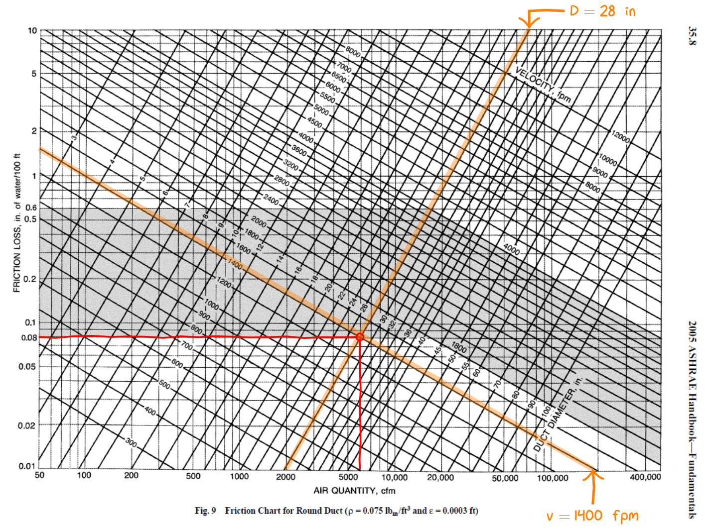

$$
\require{cancel}
\newcommand{\s}{\mathrm{s}}
\newcommand{\min}{\mathrm{min}}
\newcommand{\hr}{\mathrm{hr}}
\newcommand{\kg}{\mathrm{kg}}
\newcommand{\kN}{\mathrm{kN}}
\newcommand{\inch}{\mathrm{in}}
\newcommand{\ft}{\mathrm{ft}}
\newcommand{\m}{\mathrm{m}}
\newcommand{\mm}{\mathrm{mm}}
\newcommand{\km}{\mathrm{km}}
\newcommand{\mi}{\mathrm{mi}}
\newcommand{\cm}{\mathrm{cm}}
\newcommand{\lb}{\mathrm{lb}}
\newcommand{\lbm}{\mathrm{lbm}}
\newcommand{\lbf}{\mathrm{lbf}}
\newcommand{\N}{\mathrm{N}}
\newcommand{\slug}{\mathrm{slug}}
\newcommand{\Pa}{\mathrm{Pa}}
\newcommand{\kPa}{\mathrm{kPa}}
\newcommand{\mph}{\mathrm{mph}}
\renewcommand{\psi}{\mathrm{psi}}
\newcommand{\C}{^\circ\mathrm{C}}
\newcommand{\F}{^\circ\mathrm{F}}
\newcommand{\Re}{\mathrm{Re}}
\newcommand{\WP}{\mathrm{WP}}
\newcommand{\L}{\mathrm{L}}
\newcommand{\gpm}{\mathrm{gpm}}
\newcommand{\cfm}{\mathrm{cfm}}
\newcommand{\fpm}{\mathrm{fpm}}
\newcommand{\inwg}{\mathrm{inH}_2\mathrom{O}}
$$

# HVAC Duct Design
{:.no_toc}

* A markdown unordered list for the toc
{:toc}

# Energy loss in pipes due to friction

For this topic we will stay within the inch-pound system.

<table class="table table-striped">
<caption>

HVAC variables in the inch-pound system
</caption>
<thead>
<tr><th> Variable  </th><th> Name </th><th>units</th></tr>
</thead>
<tbody>
<tr><td>Q</td><td>Volume flow rate</td><td>$\ft^3/\min\equiv\cfm$</td></tr>
<tr><td>v</td><td>Velocity</td><td>$\ft/\min\equiv\fpm$</td></tr>
<tr><td>p</td><td>Pressure</td><td>$\inwg</td></tr>
</tbody>
</table>


Air flows at 6000 cfm through 80 ft of circular duct having a diameter of 28 inches.  Compute the flow velocity of the air in the duct and the losses due to friction.  Take the roughness of the duct to be that of medium smooth galvanized steel, $\epsilon=0.0036~\inch$.

The air velocity is found from the continuity equation:

$$
v=\frac{Q}{A}=144 \frac{6000~\cfm}{\pi/4(28)^2}=1400 \fpm
$$

The Reynolds number of the flow is
$$
\Re=8.6 v D=8.6(1400)(28)=337,000
$$
and therefore turbulent.  The relative roughness is
$$
\epsilon/D=0.0036/28=0.00013
$$
and the friction factor $f=0.01545$ is obtained from <a href="https://kdusling.github.io/teaching/Applied-Fluids/FrictionFactor.html">an online calculator</a>.

The pressure drop is then:
$$
\Delta p_f=12 f \frac{L}{D}p_v=12(0.01545)\frac{80}{28}\left(\frac{1400}{4005}\right)=0.064~\inwg
$$

Alternatively we can use the ASHRAE friction chart.

  
  

  For a volume flow rate of $Q=6000~\cfm$ and duct diameter $D=28~\inch$ we find the air velcoity is $v=1400~\fpm$ and the pressure drop per 100 feet of duct is 0.08~\inwg.
  

  This allows us to find the friction in 100 feet of duct.  In our case we have 80 feet of duct.  The pressure drop is therefore
$$
\Delta p_f=0.08\frac{\inwg}{100 \ft}\times 80\ft=0.064~\inwg
$$

