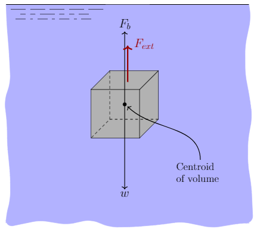

$$
\require{cancel}$$
\newcommand{\kg}{\mathrm{kg}}
\newcommand{\kN}{\mathrm{kN}}
\newcommand{\inch}{\mathrm{in}}
\newcommand{\ft}{\mathrm{ft}}
\newcommand{\m}{\mathrm{m}}
\newcommand{\cm}{\mathrm{cm}}
\newcommand{\lb}{\mathrm{lb}}
\newcommand{\N}{\mathrm{N}}
\newcommand{\Pa}{\mathrm{Pa}}
$$

# Buoyancy
{:.no_toc}

* A markdown unordered list for the toc
{:toc}

# The nature of buoyancy

# Buoyant force

Buoyancy is a force that opposes the weight of a submerged or partially submerged object. The buoyancy force acts vertically upward at the *centroid* of the displaced volume. It will be important later to differentiate between centroid and center of gravity. The centroid is the geometric center of the object. The center of gravity is the average location of the weight of an object. For objects of uniform density the centroid and center of gravity coincide. The magnitude of the buoyant force is given as;

$$
\begin{align}
\textrm{Buoyant force}&=\textrm{Specific weight of fluid}\times\textrm{Displaced volume of fluid}\nonumber\\
F_b&=\gamma_f\,\times\, V_d
\end{align}
$$

An object will float if the buoyant force is larger than the force of gravity and will sink otherwise. The weight of a solid object is given by $w=\gamma V$, where $\gamma$ is the specific weight of the object (not the fluid) and $V$ is the volume of the object (which is different than $V_d$ if the object is partially submerged).

A cube $0.50~\m$ on a side is made of steel having a specific weight of $76.5~\kN/\m^3$. What force is required to hold the cube in equilibrium when completely submerged in water? How about if the cube was made of Styrofoam having a specific weight of $0.4~\kN/\m^3$?

We start by drawing a free-body diagram of the cube. The force of gravity acts at the center of gravity (assuming the cube has uniform density the center of gravity is the same as the centroid). It is labeled in the figure as $w$ and points downward. The buoyancy force (labeled $F_b$) acts at the centroid and points upward.

Our intuition tells us that the cube of steel will sink and that the external force must be upward. Our intuition is correct as an object with an average specific weight greater than that of surrounding fluid will tend to sink. We therefore draw the external force $F_{ext}$ as pointing upward in our free-body diagram.

In equilibrium the sum of the forces must equal zero,

$$ \sum F_y=F_b+F_{ext}-w=0 $$

solving for $F_{ext}$

$$ F_{ext}=w-F_b $$

In evaluating the weight we will need the volume of the cube:
$$
V=(0.5~\m)^3 = 0.125~\m^3
$$

The weight of the cube is therefore
$$
w=\gamma_{\rm steel}\,\times\, V = 76.5~\frac{\kN}{\m^3}\times 0.125~\m^3 = 9.56~\kN\,.
$$

Since the cube is fully submerged the volume of water displaced by the cube is the same as the volume of the cube. The buoyancy force is therefore,
$$
F_b=\gamma_f\,\times\, V_d = 9.81~\frac{\kN}{\m^3}\times 0.125~\m^3 =1.23~\kN\,.
$$

We therefore evaluation $F_{ext}$ to be
$$
F_{ext}=w-F_b=9.56~\kN - 1.23~\kN = 8.33~\kN
$$
Since the external force evaluated to a positive value we chose the correct direction. That is, we correctly assumed that we would need to apply an upward force on the cube to prevent it from sinking. In this case the buoyancy force was not able to overcome the force of gravity.

We now consider the case when the cube is made of Styrofoam. Since the average specific weight of a Styrofoam cube is less than that of the surrounding water the cube will tend to float. However, let us wrongly assume that our external force is acting upwards so we can make use of the same free-body diagram and equations as before.

The weight of the Styrofoam cube is $$ w=\gamma_{\rm Styrofoam}\,\times\, V = 0.4~\frac{\kN}{\m^3}\times 0.125~\m^3 = 0.05~\kN\,. $$

The buoyancy force is the same for Styrofoam and steel! The buoyancy force depends on the specific weight of the fluid (in this case water) and the volume displaced by the object (see eq.~\ref{eq:buoyancy}. It doesn\'t matter what the object is made of!

We can now evaluate the external force and find $$ F_{ext}=w-F_b=0.05~\kN - 1.23~\kN = -1.18~\kN $$ The negative value of the external force resulted from the incorrect assumption about its direction. In order to keep the Styrofoam cube submerged we must supply a $1.18~\kN$ force *downward*.

